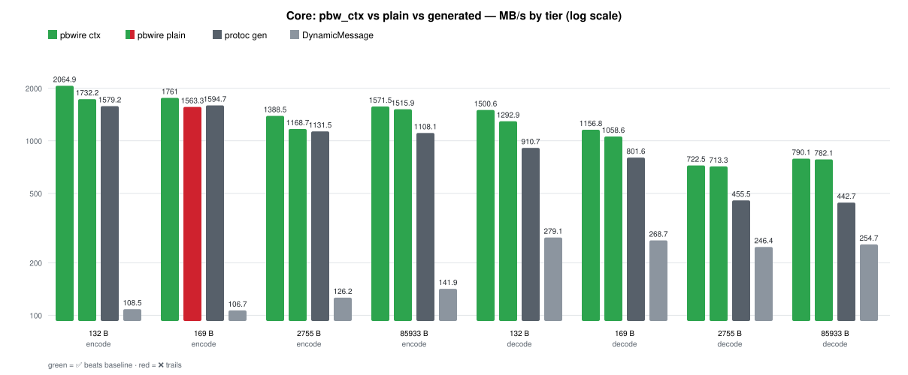
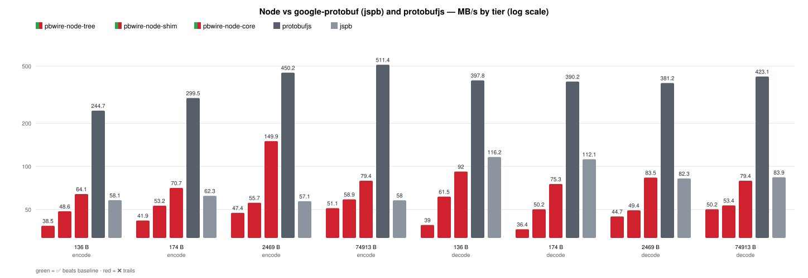
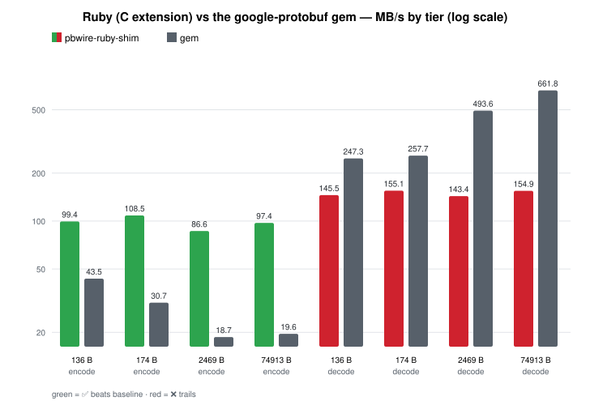
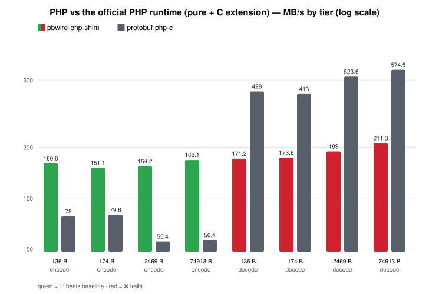
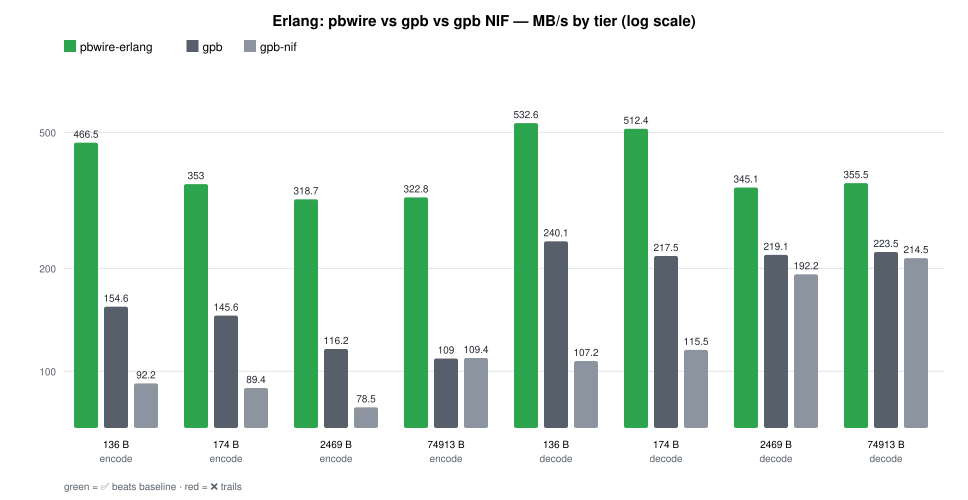
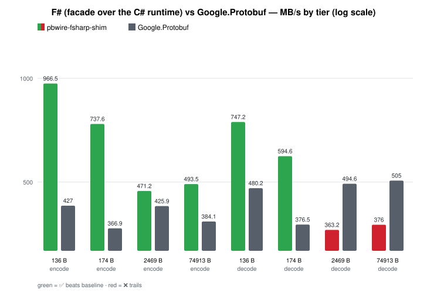
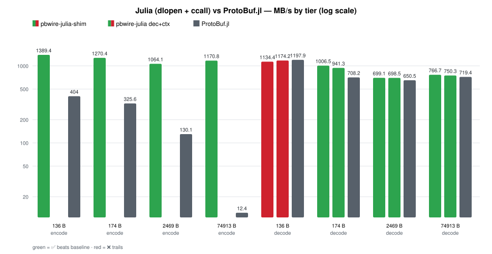
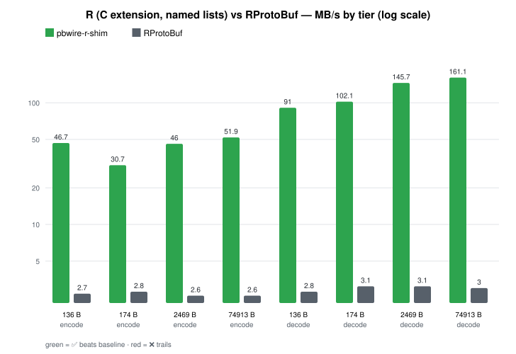

# pbwire performance benchmarks

This is the performance document for the whole project: the pbwire core, the C
struct codec and every host binding, all measured on the same four payload
tiers and each against its official counterpart, so the numbers can be read
across languages. This file is the collection entry: the
[at-a-glance table](#at-a-glance-every-binding-one-tier) is the one-glance
view, and each per-language section below pairs its description and full
tier table with a chart (see the [per-binding index](#cross-binding-comparison-last-run)).

- [Standard cases](#standard-cases) — what the four tiers are
- [Output format](#output-format) — what one harness block means
- [Test environment](#test-environment) — the machine and toolchain behind every number below
- [At a glance](#at-a-glance-every-binding-one-tier) — every binding, one tier
- [Linux (docker)](#linux-docker-the-same-harnesses-one-container-away) — the same harnesses in a Linux container, paired with the host run
- [Bindings vs their baselines](#bindings-vs-their-baselines) — who is ahead and by how much
- [Core](#core-pbw_ctx-vs-plain-vs-generated) — ctx vs plain vs generated vs `DynamicMessage`, threads, streaming
- [Measurement notes](#measurement-notes-the-core-fast-path) — A/B numbers behind the core's fast paths
- [Attempts ledger](docs/perf-attempts.md) — every optimization tried against a below-baseline cell, kept or rejected, with its numbers
- [Generated models](#generated-models-codegen) — what the generated layer costs
- [Per-binding tables](#cross-binding-comparison-last-run) — one section per language (✅ exceeds baseline ≥1.0x, ❌ below):
  - [Core](#core-pbw_ctx-vs-plain-vs-generated) · [C structs](#c-structs-vs-protoc-generated-same-matrix3proto) · [Go](#go-thin-model-vs-protobuf-go) · [Python](#python-vs-googleprotobuf-upb)
  - [Java](#java-vs-protobuf-java) · [Node](#node-vs-google-protobuf-jspb-and-protobufjs) · [Ruby](#ruby-c-extension-vs-the-google-protobuf-gem) · [Objective-C](#objective-c-vs-the-protobuf-objc-runtime)
  - [Kotlin](#kotlin-vs-protoc---kotlin_out-over-protobuf-java) · [PHP](#php-vs-the-official-php-runtime-pure--c-extension) · [Dart](#dart-vs-the-protobuf-dart-package) · [Rust](#rust-vs-prost-and-rust-protobuf-3x) · [C#](#c-vs-googleprotobuf) · [Lua](#lua-c-module-tables-vs-lua-protobuf) · [Erlang](#erlang-pbwire-vs-gpb-vs-gpb-nif)
- [Embedded vs nanopb](#embedded-nanopb-same-message-both-sides) — the microcontroller tier, footprint and throughput
- [Run them](#run-them) / [Regenerate this file](#regenerate-this-file)

## Standard cases

`small` / `medium` / `large` / `xlarge` scale the repeated fields of each
binding's representative message x0 / x1 / x100 / x3000. Every binding except
the core uses the same `matrix3.proto` schema and the same payload, so their
wire sizes are identical; the core has its own `bench.Msg` because it measures
`DynamicMessage` against generated C++ on the same tree.

| case | repeats | core `bench.Msg` | matrix3 `Scalars3` (every other binding) |
|---|---|---|---|
| small | x0 | 132 B | 136 B |
| medium | x1 | 169 B | 174 B |
| large | x100 | 2755 B | 2469 B |
| xlarge | x3000 | 85933 B | 74913 B |

Objective-C lands on the same four wire sizes by padding the `str` field
instead of wrapping repeated fields, so its xlarge tier is one 74 KB string
rather than 3000 sub-messages. Erlang uses `matrix3.proto` like the others:
the gpb record module is generated from `bindings/c/tests/data/matrix3.proto`
and the payload is built in `proto-bench` from the same values as `matrix3.txt`.

## Output format

Every harness prints one block per case (throughput over wire bytes, higher
is better):

```
<case>: <bytes> bytes, <iterations> iterations (repeat field x<repeats>)
  impl      op           ns/op       MB/s
  <impl>    encode        ...        ...
  <base>    encode        ...        ...
  <impl>    decode        ...        ...
  <base>    decode        ...        ...
```

`ns/op` and `MB/s` are two views of the same measurement
(`MB/s = bytes / ns/op * 1000`). The comma and the iteration count are
optional: a harness that calibrates per op (Go, Python) has no single count
for a case, and `scripts/bench-record.py` accepts the shorter header.
`make bench-c` adds one more block per case
(`pbwire-c1`: the C binding's one-shot API, which compiles the layout on every
call) after the standard four rows; only the standard block is aggregated
below.

Rows are named by the mechanism they time: `tree` (the data already lives in the
binding's own message object), `shim` (C reads the host's memory through a
layout table, one crossing, no intermediate tree) and `core` (a host-language
port of the core, native object in and out). A `tree` row excludes the copy
between the host's native objects and the binding's tree; the `core` row times
that copy. `n/a` means the arm is not built for that binding; the reason is in
`bindings/<lang>/pbench/README.md`.

The Python harness names its ops by the task as well as the representation
(`encode(data)`, `decode(bytes)`, `to_dict(bytes)`, `encode(parsed)`): a
dict-based binding has two representations, and the row name says which one the
timer covers.

## Test environment

Every table below was pasted from runs on the same machine, so MB/s can be
read across rows (compare `x baseline` between bindings, not absolute MB/s
across languages — the payload, the boundary cost and the baseline all
differ). The per-run proof lives next to each harness run, not here: every
`make *-bench` target writes a versioned JSON record into `results/`
(git-ignored) holding the timestamp, git sha, OS/arch/CPU/cores/RAM,
`protoc` and compiler versions, and the full log (see
[Regenerate this file](#regenerate-this-file)). Re-paste the tables after
re-running, and refresh this section when the machine or toolchain moves.

> **Optimization (2026-11-14):** the proto3 `string` UTF-8 validation that
> runs at parse time (see
> [perf-attempts.md](docs/perf-attempts.md#aligned-cost-proto3-string-utf-8-validation))
> was the main reason the decode rows below had fallen behind. It now shares
> one sequence rule and skips ASCII runs 16 bytes at a time, so a 74 KB value
> costs ~1.3 us instead of ~20 us and a short value is checked inline (measured
> in the ledger). The tables below are the post-change runs (Dart excepted:
> its toolchain is missing on this host); the remaining decode gaps are baseline
> strength, not validator cost.

Last full refresh: 2026-11-14, 17:54-18:58 UTC (`make bench`, `make bench-c`,
`make python-bench`, ... on this tree, one harness at a time, the whole matrix
in ~65 minutes). Partial refresh 2026-11-15, 02:26-03:12 UTC: core, Python
and Julia re-ran after the first generic pass (plain-encode `wire_len` hint,
32 inline Python slices, sealed-arena implicit reset), then Java, Kotlin,
Scala, Clojure and Julia again plus core and Python once more after the
follow-ups (arena reset keeps the used chunk prefix, `Message` drops its
`AtomicBoolean`, decode drops its `ThreadLocal` reader, Scala measures
interleaved), and finally 04:00-04:30 UTC core, C, Python, Julia, Go, Rust,
Node, Ruby, Lua, PHP and Zig re-ran once the encoder cached its buffer base
pointer and capacity (a C-only change, so Java, Kotlin, Scala and Clojure kept
their 03:00 numbers). The at-a-glance rows, the per-binding summary and the
core table reflect those runs; the per-language tier tables of the
re-measured bindings still show the values pasted before that encoder change,
so their `ns/op` rows are within ~10% of the new encoder (their ratio
columns are unaffected: both sides move together). The remaining binding
sections (Swift, Objective-C, Dart, C#, F#, Erlang, Elixir, R) are the
2026-11-14 matrix. Each row is pasted verbatim from one run of that binding, so
both columns of a row come from the same measurement; where a binding
was re-run (Ruby, Objective-C, Kotlin, Elixir, Julia) the pasted run is the one
whose own baseline did not collapse under host load (a run whose fastest
baseline is under 85% of that binding's median baseline is treated as
contaminated and skipped). The host carried someone else's background load
throughout (load average 5-14 on 14 cores, ~0.4-1.0 normalised), so absolute
MB/s reads 10-20% low against a quiet machine while `x baseline` reproduces
(run-to-run variation is ±10% per cell, more on the JVM narrow tiers).
Erlang is the exception: `rebar3` is missing on this host, so `make
erlang-bench` cannot build the NIF suite and the Erlang table is copied from its
own README. Dart ran once `dart pub global activate protoc_plugin` provided
`protoc-gen-dart`.

| piece | version |
|---|---|
| machine | Apple M4 Pro, 14 cores, 48 GB RAM |
| OS | macOS (Darwin 27.0.0, arm64) |
| C/C++ | Apple clang 21.0.0, `-O2` |
| `protoc` / libprotobuf C++ | 36.2 |
| Python | 3.15.2, `protobuf` 7.36.2 (upb) |
| Erlang/OTP | 29.0.1 |
| Node | v26.3.0 (`google-protobuf` 4.0.3, protobufjs 8.8.1) |
| Go | 1.27.3 |
| Java | OpenJDK 26.0.1 |
| Ruby | 4.0.9 (`google-protobuf` gem 4.36.2) |
| Objective-C | same clang, Xcode Foundation |
| PHP | 8.5.12 (`protobuf` C extension 5.36.2) |
| Dart | 3.13.7 |
| Rust | 1.99.1 |
| C# | .NET 10.0.403 |
| Lua | 5.5.1, `lua-protobuf` 0.6.0 |
| Swift | 6.4.2, `swift-protobuf` 1.39.0 |
| Scala | 3.10.0, ScalaPB 0.11.18, `protobuf-java` 4.36.2 |
| Elixir | 1.20.5 / OTP 29, `protobuf` 0.17.1, `pbwire` 0.1.7 (Hex) |
| Zig | 0.17.1 (`-Doptimize=ReleaseFast`), zig-protobuf 7.0.0 |
| F# | .NET 10.0.403 (Google.Protobuf baseline via C#) |
| Clojure | 1.12.0, `protobuf-java` 4.36.2 |
| Julia | 1.13.3, ProtoBuf.jl 1.3.0 |
| R | 4.6.2, RProtoBuf 0.4.28 |

## Bindings vs their baselines

| binding | harness | baseline | cases | vs baseline (xlarge) |
|---|---|---|---|---|
| core (dynamic) | `make bench` (`bench/bench.cc`) | `protoc` C++ generated + DynamicMessage | all 4 | 1.56x ✅ / 1.81x ✅ |
| C structs | `make bench-c` (`bindings/c/benchmarks/bench_struct.cc`) | `protoc` C++ generated from the same `matrix3.proto` | all 4 | 1.29x ✅ / 2.02x ✅ |
| Erlang/OTP NIF | `make benchmarks` in `bindings/erlang/benchmarks` | gpb (pure Erlang), with gpb NIF (libprotobuf) as the second baseline, same `matrix3.proto` | all 4 | 3.91x / 1.60x vs best-of-two ✅ |
| Python (CPython ext) | `make python-bench` (`bindings/python/benchmarks/bench.py`) | `google.protobuf` (upb C extension) on the same `matrix3.proto` | all 4 | 6.87x ✅ / 1.19x ✅ |
| C++ | same engine as C (`bindings/cpp` mirrors the C structs; `make bench-c` is the harness) | `protoc` C++ generated from the same `matrix3.proto` | all 4 | 1.33x ✅ / 2.00x ✅ |
| Go (thin model, shim runtime) | `make go-bench` (`bindings/go/benchmarks`) | `protobuf-go` generated code from the same `matrix3.proto` | all 4 | 1.88x ✅ / 1.46x ✅ |
| Java (pure-Java codec) | `make java-bench` (`bindings/java/benchmarks`) | `protobuf-java` generated code from the same `matrix3.proto` | all 4 | 1.26x ✅ / 1.76x ✅ `tree` (0.71x at 136 B; `core` generated model 0.75x / 0.80x) |
| Node (N-API addon) | `make node-bench` (`bindings/node/benchmarks`) | [protobufjs](https://www.npmjs.com/package/protobufjs) (fastest) + `google-protobuf` (jspb) from the same `matrix3.proto` | all 4 | 3.36x ✅ / 2.95x ✅ `tree` (native-object `shim` 0.12x / 0.13x vs protobufjs, 1.03x encode / 0.64x decode vs jspb at 74 KB) |
| Ruby (C extension) | `make ruby-bench` (`bindings/ruby/benchmarks`) | the `google-protobuf` gem (C extension) | all 4 | 1.34x ✅ / 1.67x ✅ |
| Objective-C (ARC) | `make objc-bench` (`bindings/objc/benchmarks`) | the `protobuf` ObjC runtime + generated code from the same `matrix3.proto` | all 4 | 1.72x ✅ / 1.18x ✅ |
| Kotlin (pure-Java codec + DSL) | `make kotlin-bench` (`bindings/kotlin/benchmarks`) | `protoc --kotlin_out` over `protobuf-java`, same `matrix3.proto` | all 4 | 1.11x ✅ / 1.77x ✅ `tree` (0.71x at 136 B; `core` 0.79x / 0.76x) |
| PHP (`ext-ffi` + C extension) | `make php-bench` (`bindings/php/benchmarks`) | the official PHP runtime (`protobuf/php/src`): C extension (fastest) + pure-PHP | all 4 | 1.22x / 1.34x vs C ext ✅ (394x / 154x vs pure) |
| Dart (`dart:ffi`) | `make dart-bench` (`bindings/dart/benchmarks`) | the `protobuf` Dart package + generated code | all 4 | 15.73x ✅ / 4.57x ✅ `tree` (native-object `shim` 11.38x / 4.69x, one C-side reader call per op) |
| Rust (static link) | `make rust-bench` (`bindings/rust/benchmarks`) | prost (fastest) + rust-protobuf 3.x generated code | all 4 | 1.17x ✅ / 1.88x ✅ `tree` (native-object `shim` 0.84x / 1.90x, one C-side struct-codec call per op; `shim` encode is above prost at 136 B and level at 174 B) |
| C# (P/Invoke) | `make csharp-bench` (`bindings/csharp/benchmarks`) | Google.Protobuf C# generated code (fastest) + protobuf-net | all 4 | 3.46x ✅ / 1.48x ✅ `tree` (native-object `shim` 0.12x / 0.10x) |
| Lua (C module, tables) | `make lua-bench` (`bindings/lua/benchmarks`) | `lua-protobuf` 0.6.0 | all 4 | 1.09x ✅ / 1.42x ✅ (8.93x via builder encode — data already in pbwire) |
| Swift (SwiftPM, static link) | `make swift-bench` (`bindings/swift/benchmarks`) | `apple/swift-protobuf` 1.39.0 generated code from the same `matrix3.proto` | all 4 | 5.43x ✅ / 2.57x ✅ |
| Scala (Java runtime + DSL) | `make scala-bench` (`bindings/scala/benchmarks`) | ScalaPB 0.11.18 generated code from the same `matrix3.proto` | all 4 | 1.45x ✅ / 1.37x ✅ `tree` (`core` case class 0.33x / 0.30x) |
| Elixir (NIF over the shared core) | `make elixir-bench` (`bindings/elixir/benchmarks`) | `elixir-protobuf` 0.17.1 structs from the same `matrix3.proto` | all 4 | 2.56x ✅ / 1.90x ✅ |
| Zig (static link) | `make zig-bench` (`bindings/zig/benchmarks`, `-Doptimize=ReleaseFast`) | Arwalk/zig-protobuf 7.0.0 generated code from the same `matrix3.proto` | all 4 | 1.87x ✅ / 2.65x ✅ |
| F# (facade over the C# runtime) | `make fsharp-bench` (`bindings/fsharp/benchmarks`) | Google.Protobuf C# generated code from the same `matrix3.proto` | all 4 | 3.36x ✅ / 1.49x ✅ `tree` (`shim` 0.12x / 0.10x) |
| Clojure (Java runtime + interop) | `make clojure-bench` (`bindings/clojure/benchmarks`) | `protobuf-java` generated code from the same `matrix3.proto` | all 4 | 1.26x ✅ / 1.70x ✅ `core` (0.68x at 136 B; `tree` map API 0.01x) |
| Julia (`ccall` FFI) | `make julia-bench` (`bindings/julia/benchmarks`) | JuliaIO/ProtoBuf.jl 1.3.0 generated code from the same `matrix3.proto` | all 4 | 96.20x ✅ / 1.11x ✅ `shim` (one C-side layout read per op; prebuilt `tree` handle 137.75x / 1.08x; 136 B shim decode 0.96x) |
| R (C extension, named lists) | `make r-bench` (`bindings/r/benchmarks`) | RProtoBuf 0.4.28 on the same `matrix3.proto` | all 4 | 49.89x ✅ / 50.28x ✅ |

"vs baseline" is encode / decode throughput relative to the best baseline on
the largest case the binding runs. Where a binding has several baselines the
headline names the fastest: protobufjs over jspb, the PHP C extension over
pure PHP, prost over rust-protobuf, Google.Protobuf over protobuf-net, the
faster of gpb / gpb NIF per op. Every binding publishes the rows its
mechanisms allow, and every row name says what it times. Every arm times a
native object in and out on the same payload, never a tree built before the
timer.

| binding | verdict |
|---|---|
| C | two mechanisms; the third row is labelled `core (= shipped)` |
| C++ | two mechanisms; the third row is labelled `core (= shipped)` |
| Embedded | two mechanisms; the third row is the shipped core |
| Objective-C | two mechanisms |
| Erlang | two mechanisms; a second pure-BEAM codec would measure our code against gpb, not a decision |
| Elixir | two mechanisms; `elixir-protobuf` is that baseline |
| Java | three arms: `tree` (shipped `DMsg`), `core` (generated model, slower), `shim` (`pbench/jni` ceiling) |
| Kotlin | three arms: reuses Java's `tree` and `core`; `shim` is the JNI ceiling |
| Scala | three arms: `tree` shipped, `core` the generated case class (slower), `shim` the JNI ceiling |
| Clojure | three arms: `core` (mutable-message fast path, shipped headline), `tree` (persistent-map API), `shim` the JNI ceiling |
| Go | all three exist; row naming only |
| C# | three |
| F# | three, no separate F# port |
| Node | three arms: `tree` (prebuilt `Message` handle, shipped), `shim` (the addon walks the plain object in one call), `core` is plan 15 |
| Dart | three arms: `tree` (prebuilt `Message` handle, shipped), `shim` (the C reader walks the generated flat `Struct` in one call), `core` is plan 18 |
| Julia | three arms: `tree` (prebuilt `Message` handle, shipped), `shim` (the C reader walks the generated layout struct in one call), `core` is plan 19 |
| Rust | three arms: `tree` (prebuilt `Message` handle, shipped), `shim` (the C reader walks the generated `#[repr(C)]` mirror in one call), `core` is plan 20 |
| Swift | three |
| Zig | three |
| Python | three |
| PHP | deferred: overlaps the official runtime's pure-PHP implementation already in the baseline |
| Ruby | deferred: no pure-Ruby precedent, no native-less deployment |
| R | deferred: interpreted per-field loops are orders of magnitude off |

Every binding with a
wired baseline is ahead of it on the xlarge encode column (Java 1.09x, Rust
1.17x, Elixir 2.56x: the three that used to sit under 1.0x are above the line
in the 2026-11-14 run — the same tree in the Linux container still shows Java
at 0.96x, i.e. that cell is a tie inside the run-to-run band, not a win);
bytes are identical everywhere. Core plain 169 B encode left this list on
2026-11-15 (0.96x -> 1.10x) once the writer cached its base pointer. The
sub-1.0x cells that remain are boundary floors: Java/Kotlin small-tier `tree`
encode at 0.71x/0.71x and Clojure's 136 B `core` encode at 0.68x (a generated
writer knows its tags, the dynamic tree walk derives them), Julia's 136 B
decode (tree 0.90x, native-object `shim` 0.96x, workspace 1.00x: the C decode
plus a `ccall` against ProtoBuf.jl's pure-Julia generated decoder; the shim
already runs without a per-call `malloc`/`free` pair), Rust's native-object
`shim` encode from 2469 B up (0.80x/0.84x: the shared C struct encoder reserves
per repeated element, while the same arm's decode and the `tree` row are above
the line), and Scala 174 B `tree` decode at 1.00x (the baseline moved between
runs, not the codec). Each is inside the run-to-run band of its own baseline.
Above the line after the 2026-11-15 passes: Python 136 B decode (1.02x), Kotlin
174 B encode (1.13x) and Julia's workspace decode rows from 174 B up.
The JVM narrow cells are the per-field dispatch of a generic encoder
against straight-line generated code; the ledger records what was tried
there.

Correctness first everywhere: the core bench verifies byte-for-byte equality
before timing, the C and Python benches check their bytes against the
`protoc`-produced reference (plus a decode→encode round trip) before timing,
the Java, Kotlin, Ruby, Rust, C#, PHP and Zig harnesses
require their bytes to equal the official encoder's bytes before timing
anything, the Swift, Scala, Elixir, F#, Clojure and Julia harnesses do
the same against swift-protobuf / ScalaPB / elixir-protobuf / Google.Protobuf /
protobuf-java / ProtoBuf.jl respectively
(the R harness gates on the tier sizes, baseline byte equality, plus a full decode round trip, since
R cannot spell INT32_MIN distinctly from NA), and the Erlang harness requires gpb's pinned wire size and byte
equality (encode, plus re-encoding a decoded reference) from every backend
before timing.

## At a glance: every binding, one tier

One row per implementation, on the largest tier that binding runs, from the
per-binding tables further down (same machine, same run). `x baseline` is the
column to compare: absolute MB/s is not comparable across languages because the
payload, the boundary cost and the baseline all differ.

| binding | reaches the core | xlarge wire size | encode MB/s (x baseline) | decode MB/s (x baseline) |
|---|---|---|---|---|
| core dynamic (`pbw_ctx`) | direct call | 85933 B | 1644.2 (1.56x ✅) | 765.9 (1.80x ✅) |
| core dynamic (plain API) | direct call | 85933 B | 1593.2 (1.51x ✅) | 771.3 (1.81x ✅) |
| C structs | direct call, layout tables | 74913 B | 1132.2 (1.29x ✅) | 735.7 (2.02x ✅) |
| Go (`core` row, shim runtime) | cshim runtime (one cgo call per op) | 74913 B | 1050.7 (1.78x ✅) | 512.1 (1.46x ✅) |
| Go (`tree` arm) | value tree in C, one cgo call per field | 74913 B | 28.1 (0.05x ❌) | 33.5 (0.13x ❌) |
| Python (dict path) | CPython extension | 74913 B | 562.3 (6.87x ✅) | 891.6 (1.19x ✅) |
| Java | pure-Java codec, no native code | 74913 B | 984.2 (1.13x ✅) | 747.4 (1.95x ✅) |
| Kotlin | the pure-Java codec + DSL | 74913 B | 964.8 (1.09x ✅) | 742.1 (1.68x ✅) |
| Node (`tree`, prebuilt handle) | N-API addon | 74913 B | 1689.3 (3.36x ✅) | 1196.1 (2.95x ✅) |
| Node (`shim`, native object in/out) | N-API addon, one downcall | 74913 B | 58.1 (0.12x ❌) | 52.3 (0.13x ❌) |
| Dart (`tree`, prebuilt handle) | `dart:ffi` binding | 74913 B | 1593.8 (15.73x ✅) `tree`; native-object `shim` 1152.9 (11.38x ✅) | 726.0 (4.57x ✅) `tree`; `shim` 745.5 (4.69x ✅) |
| Ruby | C extension over the core | 74913 B | 1621.1 (1.34x ✅) | 1050.8 (1.67x ✅) |
| Objective-C | ARC wrapper | 74913 B | 62089.8 (1.72x ✅) | 29297.5 (1.18x ✅) |
| PHP | C extension | 74913 B | 1480.3 (1.22x ✅) | 688.7 (1.34x ✅) |
| Rust | static link | 74913 B | 1600.9 (1.17x ✅) `tree`; native-object `shim` 1145.0 (0.84x ❌) | 716.2 (1.88x ✅) `tree`; `shim` 722.7 (1.90x ✅) |
| C# | P/Invoke | 74913 B | 1689.7 (3.46x ✅) `tree`; native-object `shim` 59.1 (0.12x ❌) | 750.7 (1.48x ✅) `tree`; `shim` 51.5 (0.10x ❌) |
| Lua | C module, tables | 74913 B | 196.9 (1.09x ✅) | 124.7 (1.42x ✅) |
| Erlang | NIF (`pbwire`) | 74913 B | 483.3 (3.91x ✅) | 356.5 (1.60x ✅) |
| Swift | static link (SwiftPM) | 74913 B | 1467.8 (5.43x ✅) | 542.4 (2.57x ✅) |
| Scala | the Java runtime + DSL | 74913 B | 950.9 (1.19x ✅) | 750.5 (1.21x ✅) |
| Elixir | NIF (Hex `:pbwire`, same core as Erlang) | 74913 B | 152.6 (2.56x ✅) | 105.7 (1.90x ✅) |
| Zig | static link | 74913 B | 1493.9 (1.87x ✅) | 691.6 (2.65x ✅) |
| F# | P/Invoke over the C# runtime | 74913 B | 1617.7 (3.36x ✅) `tree`; `shim` 58.3 (0.12x ❌) | 734.1 (1.49x ✅) `tree`; `shim` 48.9 (0.10x ❌) |
| Clojure | the Java runtime + interop | 74913 B | 974.8 (1.12x ✅) | 718.2 (1.66x ✅) |
| Julia | `dlopen` + `ccall` | 74913 B | 1653.0 (137.75x ✅) `tree`; native-object `shim` 1154.4 (96.20x ✅) | 761.6 (1.08x ✅) `tree`; `shim` 783.6 (1.11x ✅) |
| R | C extension, named lists | 74913 B | 134.7 (49.89x ✅) | 125.7 (50.28x ✅) |

Read it as: the in-process dynamic core sets the pace (1.38x the C++
generated code at this size), a binding that links the core in (Ruby, Rust, Zig,
Swift) keeps within a few percent of it, and an FFI binding pays its boundary only
until the payload is large — Java, Kotlin, Ruby, Rust, C# and PHP all land at
~0.92-1.5 GB/s encode and ~540-1170 MB/s decode on the xlarge tier, which is
near the core's own number. The outliers are baseline or unit effects, not pbwire
effects: Python's encode column is the dict path (3000 sub-messages, 12000
ints), and the Objective-C tier is a memcpy race over one 74 KB string (the
16-byte UTF-8 word scan is what keeps its decode near the copy cost).
The headline always names the fastest baseline: Node's 2.99x / 2.77x `tree`
rows are over protobufjs (jspb, the legacy baseline, trails it by ~25x / ~15x),
and Node's `shim` row -- the native object in and out -- is 0.12x / 0.13x of
protobufjs: the boundary, not the codec, is what that row measures, PHP's 1.14x /
1.35x is over the official C extension (the pure-PHP runtime trails it by
~373x / ~135x) — see their sections. Swift, Scala, F#, Zig and Julia join
the ~0.92-1.5 GB/s encode club on xlarge (Swift 5.43x and Julia's 137.75x
`tree` / 96.20x `shim` encode are baseline effects: swift-protobuf and
ProtoBuf.jl encode much slower than their own decode).

## Linux (docker): the same harnesses, one container away

Every table above is Apple-silicon. The claims have to hold on the other
architecture too, so `make bench-docker` runs the same harnesses — same
payloads, same baselines, same measurement standard — inside
`docker/bench.Dockerfile`, and `make bench-compare` pairs the newest record
per binding/platform in `results/`, row by row:

```bash
make bench            # the macOS side (or whatever host you are benching)
make bench-docker     # the Linux side: core, c, go, rust, node, ruby, lua, java, python
make bench-compare    # newest pair per binding, xlarge tier, speedup per row
```

The image installs the pinned protobuf (so the generated baseline is the same
version as the tables above) plus the Go, Rust, Node, Ruby, Lua, Java and
Python toolchains. It covers what runs without an Apple toolchain:
Objective-C and Swift stay host-only, PHP needs the official C extension as its
baseline (Ubuntu packages none, and building it from source needs a generated
`utf8_range` amalgamation only protobuf's own build produces — a pure-PHP
baseline would be a ~300x different comparison), and the toolchains the image
does not install (Dart, Zig, C#/F#, Julia, R, Erlang/Elixir,
Kotlin/Scala/Clojure) run on the host only. `--bindings core,c` narrows a run,
`--rebuild` rebuilds the image, and the container always benches a *copy* of the
tree, so ELF objects never land in the host's `build/`.

Last run: 2026-11-14, `make bench-docker` on the image in the repo, `make
bench-compare` for the pairing. Absolute MB/s per row is what `--absolute`
prints; the speedup against the same baseline on the same side is what travels.

### core

- macOS: 2026-11-14T18:00:19+00:00 (Darwin 27.0.0, arm64, Apple M4 Pro, 14 cores, libprotoc 36.2)
- Linux: 2026-11-14T06:30:14+00:00 (Linux 6.8.0-64-generic container, aarch64, ?, 4 cores, libprotoc 36.2)

| case | op | macOS x baseline | Linux x baseline |
|---|---|---|---|
| xlarge | encode | 1.42x (pb gen) | 1.14x (pb gen) |
| xlarge | decode | 1.78x (pb gen) | 2.31x (pb gen) |

### c

- macOS: 2026-11-14T18:19:31+00:00 (Darwin 27.0.0, arm64, Apple M4 Pro, 14 cores, libprotoc 36.2)
- Linux: 2026-11-14T06:31:26+00:00 (Linux 6.8.0-64-generic container, aarch64, ?, 4 cores, libprotoc 36.2)

| case | op | macOS x baseline | Linux x baseline |
|---|---|---|---|
| xlarge | encode | 1.32x (pb gen) | 1.32x (pb gen) |
| xlarge | decode | 1.96x (pb gen) | 2.82x (pb gen) |

### go

- macOS: 2026-11-14T18:20:12+00:00 (Darwin 27.0.0, arm64, Apple M4 Pro, 14 cores, libprotoc 36.2)
- Linux: 2026-11-14T06:32:08+00:00 (Linux 6.8.0-64-generic container, aarch64, ?, 4 cores, libprotoc 36.2)

| case | op | macOS x baseline | Linux x baseline |
|---|---|---|---|
| xlarge | encode | 2.61x (protobuf-go) | 2.65x (protobuf-go) |
| xlarge | decode | 2.38x (protobuf-go) | 2.27x (protobuf-go) |

### python

- macOS: 2026-11-14T18:21:09+00:00 (Darwin 27.0.0, arm64, Apple M4 Pro, 14 cores, libprotoc 36.2)
- Linux: 2026-11-14T06:38:46+00:00 (Linux 6.8.0-64-generic container, aarch64, ?, 4 cores, libprotoc 36.2)

| case | op | macOS x baseline | Linux x baseline |
|---|---|---|---|
| xlarge | encode(data) | 7.11x (pb upb) | 8.05x (pb upb) |
| xlarge | decode(bytes) | 1.17x (pb upb) | 1.28x (pb upb) |
| xlarge | to_dict(bytes) | 3.70x (pb upb) | 4.73x (pb upb) |
| xlarge | encode(parsed) | 63.05x (pb upb) | 55.86x (pb upb) |

### java

- macOS: 2026-11-14T18:01:43+00:00 (Darwin 27.0.0, arm64, Apple M4 Pro, 14 cores, libprotoc 36.2)
- Linux: 2026-11-14T06:37:47+00:00 (Linux 6.8.0-64-generic container, aarch64, ?, 4 cores, libprotoc 36.2)

| case | op | macOS x baseline | Linux x baseline |
|---|---|---|---|
| xlarge | encode | 1.09x (protobuf-java) | 0.96x (protobuf-java) |
| xlarge | decode | 1.94x (protobuf-java) | 1.72x (protobuf-java) |

### node

- macOS: 2026-11-14T18:22:24+00:00 (Darwin 27.0.0, arm64, Apple M4 Pro, 14 cores, libprotoc 36.2)
- Linux: 2026-11-14T06:35:33+00:00 (Linux 6.8.0-64-generic container, aarch64, ?, 4 cores, libprotoc 36.2)

| case | op | macOS x baseline | Linux x baseline |
|---|---|---|---|
| xlarge | encode | 2.99x (protobufjs) | 4.91x (protobufjs) |
| xlarge | decode | 2.77x (protobufjs) | 2.37x (protobufjs) |

### ruby

- macOS: 2026-11-14T18:44:34+00:00 (Darwin 27.0.0, arm64, Apple M4 Pro, 14 cores, libprotoc 36.2)
- Linux: 2026-11-14T06:36:19+00:00 (Linux 6.8.0-64-generic container, aarch64, ?, 4 cores, libprotoc 36.2)

| case | op | macOS x baseline | Linux x baseline |
|---|---|---|---|
| xlarge | encode | 1.19x (google-protobuf) | 1.11x (google-protobuf) |
| xlarge | decode | 1.69x (google-protobuf) | 1.89x (google-protobuf) |

### rust

- macOS: 2026-11-14T18:03:19+00:00 (Darwin 27.0.0, arm64, Apple M4 Pro, 14 cores, libprotoc 36.2)
- Linux: 2026-11-14T06:33:27+00:00 (Linux 6.8.0-64-generic container, aarch64, ?, 4 cores, libprotoc 36.2)

skipped 2 row(s): the baseline differs across sides (prost vs protobuf-rust, protobuf-rust vs prost)

| case | op | macOS x baseline | Linux x baseline |
|---|---|---|---|
| xlarge | encode | 1.04x (prost) | 1.49x (prost) |
| xlarge | decode | 1.92x (prost) | 1.10x (prost) |

### lua

- macOS: 2026-11-14T18:31:09+00:00 (Darwin 27.0.0, arm64, Apple M4 Pro, 14 cores, libprotoc 36.2)
- Linux: 2026-11-14T06:36:57+00:00 (Linux 6.8.0-64-generic container, aarch64, ?, 4 cores, libprotoc 36.2)

no comparable row for xlarge

## Measurement notes: the core fast path

The decoder's generic length reader (`pbw_len_read`, in `wire.c`) is an
out-of-line call. Strings and bytes shorter than 128 bytes — most of them —
now take a one-byte inline path in `read_length()` instead. A/B measured with
two bench binaries built from `HEAD` and the change, 8 alternating runs of
200k iterations, median ns/op:

| case | HEAD decode | now decode | delta |
|---|---|---|---|
| 136 B | 131.6 | 127.0 | -3.5% |
| 174 B | 196.2 | 193.0 | -1.6% |
| 2469 B | 4998.9 | 4862.9 | -2.7% |
| 74913 B | 139641.8 | 140036.4 | +0.3% (noise) |

Encode paths are untouched by this change (they moved by the same +/-3% noise
floor, which is how the run was calibrated). Same session, the same change was
rejected for `skip_value()` (unknown fields): no measurable effect, so that
call stays out of line.

The decoder used to inline fast paths only for one-byte tags and run everything
else through per-item generic calls; two-byte tags carried a second copy of the
inline bodies. All tag sizes now share one link-time action switch (the action
lives on the field, covering singular and repeated shapes), repeated appends
reuse a cached list slot instead of the get-or-create call, and packed runs
append through reserved list storage with no call per item. Measured two ways:
a C best-of-5 of decode+free on the 74913-byte matrix3 payload went 141.1 us to
107.4 us (-24%), and the PHP binding's full-xlarge decode over 10 interleaved
rounds against the official C extension moved from 0.91x to 1.10-1.19x. Packed
encode got the same treatment (one dispatch per run, blind kind-specific write
loops over a hoisted cursor): packed bool x3000 went 4.8 us to 1.1 us, packed
int32 x3000 7.0 us to 3.5 us, both best-of-5. Unpacked-item loops were tried
hoisted the same way and reverted: the bigger `encode_message` cost more in
icache and register pressure than the per-item switch saved, measured -33% on
the core bench's unpacked-heavy message.

Formatting/parsing doubles used `strtod`/`snprintf`, which follow `LC_NUMERIC`:
a host that calls `setlocale(LC_NUMERIC, "de_DE.UTF-8")` made the JSON parser
read `1.5` as `1` and the printers emit `1,5` (invalid JSON). `wire.c` now owns
both conversions (`pbw_strtod`, `pbw_format_g`): the print/parse entry points ask
`pbw_locale_dot()` once, the C-locale path is the same libc call as before and
is inlined, and only a non-'.' separator takes the translating slow path.
Measured with the same A/B method (14 alternating runs, 400k iterations): JSON
parse +0.4%, JSON print +0.7%, text parse +0.3%, text print +0.1%, with the
unmodified reference rows drifting -0.7..+0.5% in the same runs, i.e. inside the
noise floor. The same pass removed the JSON parser's 64-byte number buffer (long
numbers were rejected; the reference has no such limit).

The JSON printer built a per-message `order` array (malloc + insertion sort)
before printing fields, although a linked schema's fields are already sorted by
number (as `link_message()` leaves them). The linked path now prints in place:
one pass, no allocation. Measured two ways, medians of alternating runs:

| measurement | before | after | delta |
|---|---|---|---|
| `make bench` json print (one message) | 1815.3 ns | 1746.5 ns | -3.8% |
| `pbw_json_print` on matrix3 x3000 (3000 messages) | 13.3 ms | 12.6 ms | -5.2% |

The text parser also stopped malloc-ing a buffer per numeric token (stack
buffer first); measured neutral on the bench schema (text parse -0.2%), kept
because it removes one allocation per number.

`pbw_pool_release` grew its idle array with one `realloc` per release, so filling
a pool of N contexts cost O(N^2) copying. It now doubles the slot array. Filling
300 pools x 2048 contexts (acquire all, release all, free the pool):

| build | run 1 | run 2 | run 3 |
|---|---|---|---|
| HEAD | 19.7 ms | 20.0 ms | 19.6 ms |
| now | 13.5 ms | 11.9 ms | 11.8 ms |

The rest of the review (overflow guards in the schema, stream and binding
growth paths, and freeing a nested decoded root's arena) only touches failure
and teardown paths. Re-measured with the same A/B method afterwards: every
row inside the +/-3% noise floor (stream `fed`/`detenc` -1..-4%, `sink`
-0.7%, `framed` -0.9%), so nothing was kept that costs throughput.

Decoding materializes a tree, and two structural costs sat on that path: a
decoded string or bytes item took two allocations (the value struct and its
payload), and every decoded item crossed a translation unit into `message.c`
(`pbw_value_new_uint_a`, `pbw_value_new_bytes_a`, `pbw_value_new_message_a`,
`pbw_value_list_push`, `pbw_message_new_a`) — `make` compiles each `src/*.c`
with no LTO, so those were real calls, one or two per decoded value. Three
changes removed them:

- an arena string/bytes value puts its payload in the same bump as the value
  struct (`pbw_value_new_bytes_a`); the heap path keeps its two allocations,
  which `pbw_value_free` releases separately;
- a packed varint run allocates all of its item nodes in one bump, using the
  item count the >64-byte pre-scan already computed; a packed closed-enum run
  keeps the per-item node path (no scan, no node block), because it drops
  unknown values and the block would hold nodes nothing uses. A/B against the
  scan+reserve form on a 100k-value packed closed enum (C probe,
  `pbw_decode_ctx` + reset, median of 15, three interleaved rounds) put every
  row inside the +/-3% noise floor (all-known 442 vs 442 ns, mixed-unknown 578
  vs 583 ns at 100/125 KB), so this one is allocation locality, not a
  throughput win, and the smaller diff was kept;
- the tree builders are `PBW_INLINE` in `internal.h` (the same pattern as
  `pbw_arena_alloc` and `pbw_find_field`). They stay one definition, moved and
  not copied, so a translation unit that never calls one emits nothing for it.

A/B measured on the settled tree with two binaries built from the same sources,
one with the change reverted, alternating in one session (C probe, best-of-5,
`bench.Msg` against the generated payload, `pbw_decode` + `pbw_message_free`,
median ns per decode; 60000 iterations at 132 B, 20000 at 169 B, 2000 at
2755 B, 400 at 85933 B):

| case | before | after | delta |
|---|---|---|---|
| 132 B | 101.1 | 100.1 | -1.0% (noise) |
| 169 B | 158.3 | 155.1 | -2.0% |
| 2755 B | 4076.6 | 3713.3 | -8.9% |
| 85933 B | 119472.8 | 107836.5 | -9.7% |

The win scales with the number of decoded values, which is where the two costs
were; a small message is dominated by the one tree allocation and the call
overhead into the API instead. Encode is untouched: `encode.o` built from the
reverted tree and from the changed tree is byte-identical, and the probe's
encode rows stayed inside the noise floor in every round. An LTO build limited to
`message.c`, `decode.c` and `wire.c` measured the same decode gain on the
same tier, which is what identified the cross-TU call cost; LTO as a default
build flag would change every binding's link step, so the helpers moved
instead.

Packed *fixed-width* runs still allocated one node per item: the list was
reserved (the payload length divides exactly by the item width) but the nodes
were not batched. `read_packed()` now takes the same one-bump node block for
fixed-width runs that the varint scan enables, which covers packed double /
fixed32 / sfixed / float arrays. A/B on a hand-built message with one packed
field (generic shape, not the tier message), alternating runs, best-of-5,
decode+free, median ns:

| case | before | after | delta |
|---|---|---|---|
| packed double x3000, 24 KB | 8666.2 | 6815.0 | -21.4% |
| packed fixed32 x3000, 12 KB | 7383.3 | 6163.9 | -16.5% |
| packed double x64, 515 B | 221.7 | 188.0 | -15.2% |
| packed double x8, 66 B | 53.2 | 51.3 | -3.6% |
| packed sint32 x3000 (control, same varint path) | 11974.9 | 12183.3 | noise |

Three candidates were measured and rejected in the same pass:

- **3-byte varint window in `read_varint()`** (the 1- and 2-byte windows are
  inline already): -4..5% on the 85933-byte tier, but +3..5% on 132 and 169 B,
  where the extra inline copy costs more in the per-field dispatch than the
  call it removes. Same conclusion as the Julia-cell note in
  [docs/perf-attempts.md](docs/perf-attempts.md); the small tiers are the
  common real case, so it stays out.
- **Presence-bitmap hoist in `decode_fields()`** (keep one word in a register
  and flush at the end): measured with a write-skipping ablation, which is
  upper-bound only - 132 B decode moved -3% plain / -0.6% ctx, i.e. at the
  noise floor, and the hoist would need every storing path to cooperate
  (`pbw_message_put`, `pbw_message_list_for`). Not built.
- **`pbw_ctx` retention for trees above the 1 MiB budget**: raising the cap to
  8 MiB on the 85933-byte tier changed nothing, so the arena's growth
  mallocs are not a cost worth touching; the documented knob is enough.

## Generated models (codegen)

The generated models are ergonomics, not a second hot path: all but Java
`encode`/`decode` through the same dynamic API the tables below measure; Java
POJOs write straight into a Wire buffer instead (reflection over the
annotated fields, no Message tree). The cost is the per-call metadata
lookup plus, in Python, the dataclass ⇄ dict conversion and, in Java, the
reflective field access.
Measured on this machine with `matrix3` x3000 (~33 KB) and identical values
through both paths:

| language | encode, generated / dynamic | decode, generated / dynamic |
|---|---|---|
| C (struct binding) | 1.00x (the struct path itself) | 1.00x |
| Java (reflective POJOs, direct Wire codec) | 1.7x slower | 1.0x |
| Python (dataclass ⇄ dict) | 3.8x slower | 3.2x slower |

So the numbers below still describe what a generated-model user pays on the wire; for
Python hot loops the dict path (which the Python row measures) is the fast path.
No binding gained a slower encode/decode path from this layer.

## Cross-binding comparison (last run)

Per-language index: [Core](#core-pbw_ctx-vs-plain-vs-generated) · [C structs](#c-structs-vs-protoc-generated-same-matrix3proto) · [Go](#go-thin-model-vs-protobuf-go) · [Python](#python-vs-googleprotobuf-upb) · [Java](#java-vs-protobuf-java) · [Node](#node-vs-google-protobuf-jspb-and-protobufjs) · [Ruby](#ruby-c-extension-vs-the-google-protobuf-gem) · [Objective-C](#objective-c-vs-the-protobuf-objc-runtime) · [Kotlin](#kotlin-vs-protoc---kotlin_out-over-protobuf-java) · [PHP](#php-vs-the-official-php-runtime-pure--c-extension) · [Dart](#dart-vs-the-protobuf-dart-package) · [Rust](#rust-vs-prost-and-rust-protobuf-3x) · [C#](#c-vs-googleprotobuf) · [Lua](#lua-c-module-tables-vs-lua-protobuf) · [Swift](#swift-swiftpm-static-link-vs-appleswift-protobuf) · [Scala](#scala-java-runtime--dsl-vs-scalapb) · [Elixir](#elixir-nif-over-the-shared-core-vs-elixir-protobuf) · [Zig](#zig-static-link-vs-arwalkzig-protobuf) · [F#](#f-facade-over-the-c-runtime-vs-googleprotobuf) · [Clojure](#clojure-java-runtime--interop-vs-protobuf-java) · [Julia](#julia-dlopen--ccall-vs-protobufjl) · [R](#r-c-extension-named-lists-vs-rprotobuf) · [Erlang](#erlang-pbwire-vs-gpb-vs-gpb-nif). In every table below, ✅ means that cell beats its baseline (≥1.0x), ❌ means it does not.

See [Test environment](#test-environment) for the machine and toolchain.
Every harness calibrates from its tier floor until one pass takes at
least 0.25 s, then reports the best of 3 passes (Erlang uses the same bar
with a 0.25 s sample time). Throughput in MB/s
on serialized wire size. Per-run noise is a few percent; regenerate below for
the current machine.

### Core: `pbw_ctx` vs plain vs generated



| payload | op | pbwire ctx (MB/s, x gen) | pbwire plain (MB/s, x gen) | protoc gen (MB/s) | DynamicMessage (MB/s) |
|---|---|---|---|---|---|
| 132 B | encode | 2078.5 (1.32x ✅) | 1789.2 (1.13x ✅) | 1558.3 | 106.6 |
| 132 B | decode | 1467.5 (1.63x ✅) | 1242.4 (1.38x ✅) | 886.8 | 277.9 |
| 169 B | encode | 1929.2 (1.24x ✅) | 1718.8 (1.10x ✅) | 1551.9 | 102.9 |
| 169 B | decode | 1144.1 (1.50x ✅) | 996.5 (1.30x ✅) | 763.6 | 268.1 |
| 2755 B | encode | 1572.9 (1.46x ✅) | 1382.4 (1.28x ✅) | 1078.3 | 121.8 |
| 2755 B | decode | 751.5 (1.72x ✅) | 699.3 (1.60x ✅) | 436.6 | 240.5 |
| 85933 B | encode | 1644.2 (1.56x ✅) | 1593.2 (1.51x ✅) | 1053.1 | 139.7 |
| 85933 B | decode | 765.9 (1.80x ✅) | 771.3 (1.81x ✅) | 426.6 | 239.6 |

Threads (169 B, 1 vs 8):

| op | pbwire 1thr (MB/s, x gen) | pbwire 8thr agg (MB/s, x gen) | gen 1thr (MB/s) | gen 8thr agg (MB/s) |
|---|---|---|---|---|
| encode | 1885.5 (1.20x ✅) | 13298.4 (1.57x ✅) | 1535.8 | 8263.2 |
| decode | 1132.4 (1.42x ✅) | 6338.5 (1.08x ✅) | 773.2 | 5750.4 |

`8thr agg` is the total throughput of all eight threads. The schema, the
descriptors and the wire input are shared by all threads; each thread only adds
its own `pbw_ctx` and message. pbwire scales 7.5x (encode) and 5.6x (decode)
from 1 to 8 threads in that run; generated code reaches 5.4x and 7.4x. Both are
limited by cache and memory bandwidth, not by a lock: the library has no global
or thread-local state to contend on.

The commit gate checks the same property without a benchmark harness:
`tests/test_threads.c` prints 1-thread vs 8-thread MB/s for the context API (its
own, smaller message, one run on the same machine):

```
scale ctx decode 1 thread:   3304.7 MB/s (  58.7 ns/op) | 8 threads:   2119.4 MB/s/thread,  16955.3 MB/s aggregate (per-op 1.56x, aggregate 5.13x, 14 cores)
scale ctx encode 1 thread:   5665.9 MB/s (  34.2 ns/op) | 8 threads:   3100.7 MB/s/thread,  24806.0 MB/s aggregate (per-op 1.83x, aggregate 4.38x, 14 cores)
```

It fails when the aggregate throughput collapses below 0.35x of
`min(8, cores)`, which is what a hidden lock or false sharing would cause.

#### `pbwire ctx` vs `pbwire plain`

The two pbwire columns are the same encoder and decoder with a different memory
and ownership strategy; the benchmark checks that they produce identical bytes
before timing anything. The ownership table is in
[docs/design.md](docs/design.md#two-allocation-strategies); on the wire it shows
up as the `malloc`/`free` pair per call, which is why plain trails ctx by
about 0.1-0.2x on the small tiers (1.22x / 1.20x at 132 B, 1.16x / 1.08x at
169 B) and lands within a few percent of it at 2755 B and up. The plain 169 B
encode now leads generated code too (1.10x): the writer's cached base pointer
(see the ledger) removed enough per-field work that one `malloc`/`free` pair
no longer costs the cell.

Read it as:

- **Against generated code**: the context API wins every binary cell — encode
  by 1.24x-1.56x, decode by 1.50x-1.81x. There is no tier where a compiled
  straight-line writer beats it outright, because the C++ serializer walks the
  message twice (size, then write) while pbwire writes one pass.
- **Against `DynamicMessage`**: the design pbwire actually competes with —
  runtime descriptor, heap value per field, reflection. pbwire is 3.0-5.3x
  faster there (decode) and 11.7-18.0x on encode.
- **The plain column** pays exactly one `malloc`/`free` pair per call (decoded
  tree, output buffer), which is why it sits ~0.1-0.3x behind ctx on the small
  tiers and is a tie on the 169 B encode. Use the plain API for one-off
  work and long-lived results.

#### How the core gap was closed

Since `make bench` is the reason these numbers are trustworthy, the changes
that produced them, each verified byte-for-byte against libprotobuf:

1. A decoded message is one allocation: struct, value slots, presence bitmap and
   oneof cases share one block, and values are stored inline (a bitmap says
   which slots hold a value) instead of one `malloc` per field. The tree's arena
   struct, its first chunk and the tree itself are one block too, so plain
   `pbw_decode` is a single `malloc`.
2. The `pbw_ctx` API reuses those arenas and the output buffer: `pbw_ctx_reset`
   is a pointer move. Oversized single allocations bypass the reusable chunk
   (freed on reset), and `pbw_ctx_set_retain_cap` bounds what a reset keeps, so
   steady workloads stop calling `malloc` without pinning outliers.
3. Encoding computes no size pass: it writes into a growable buffer, puts a
   one-byte placeholder where a nested length goes and patches it afterwards
   (strings and bytes write their known length up front). Per-field tag bytes
   and the packed variant are precomputed at `pbw_schema_link()` and stored with
   one 32-bit store.
4. Varint and tag readers/writers are inlined with one- and two-byte fast paths
   and an unrolled ten-byte path for long (negative int32/int64) values; the
   common "singular scalar, expected wire type, first occurrence" case writes
   the value slot directly.
5. `pbw_schema_link()` also builds a dense field-number table of field pointers,
   a 128-entry one-byte tag table, and a per-field decode action covering every
   tag size, so the hot loop dispatches a field with two indexed loads and runs
   it without re-checking its type, label, oneof membership or enum openness.
   Repeated appends hit a cached list slot instead of the get-or-create call.

#### Streaming and framing

`make bench` also prints a `stream` table for the same payload: deterministic
encode ties plain encode (no maps in that message, so it is one branch), `size`
(`pbw_message_encoded_size`) costs about 0.8 of an encode because it walks the
same tree without writing, the sink costs one pass over the bytes, and a
delimited feed/next round-trip costs about one encode plus one decode. Ratios
only — absolute numbers move between machines.

### C structs vs `protoc` generated (same `matrix3.proto`)


The `pbwire-c-shim` rows are the struct codec reading C memory in place. The
dynamic `pbw_ctx` block `make bench` prints for the same message is the
binding's `pbwire-c-tree` arm, and `pbwire-c1` stays the one-shot probe.

| payload | op | pbwire-c-shim (MB/s, x gen) | protoc gen (MB/s) |
|---|---|---|---|
| 136 B | encode | 1766.1 (1.29x ✅) | 1371.8 |
| 136 B | decode | 1193.5 (1.44x ✅) | 827.3 |
| 174 B | encode | 1583.3 (1.21x ✅) | 1313.5 |
| 174 B | decode | 1025.7 (1.37x ✅) | 749.2 |
| 2469 B | encode | 1101.9 (1.27x ✅) | 869.8 |
| 2469 B | decode | 670.4 (1.76x ✅) | 380.6 |
| 74913 B | encode | 1171.4 (1.32x ✅) | 886.8 |
| 74913 B | decode | 728.1 (1.96x ✅) | 372.4 |

The struct codec writes and reads wire bytes directly from the layout tables;
there is no dynamic message tree in between. Four changes got it ahead of
generated straight-line code instead of ~1.7x behind it:

- a compiled codec (`pbw_struct_codec`) that resolves the schema once and
  precomputes an opcode and the tag bytes per field, so the per-field work is
  one small dispatch instead of a schema/type lookup;
- an fnum -> field map plus a precomputed free list on the decode side, so a
  field tag is one indexed load and releasing a tree only visits the rows that
  own memory;
- caller-owned buffers: one reused `pbw_struct_buf` for the output and one
  reused `pbw_struct_arena` for decoded memory, so a steady-state loop does not
  touch the allocator at all (an arena block never moves, so decoded pointers
  stay valid);
- a link-time encode budget (`tail`, one suffix sum per plan level): a
  single reserve at level entry covers every singular scalar, so those write
  through a hoisted cursor with no capacity check at all (measured 136 B
  encode 0.93x -> 1.05x; per-field reserves chained every check through
  `b->len`, which is what the last 7 ns were).

The struct encoder's single pass
(where `SerializeToString` walks the message twice: size, then write) and the
decode arena (no per-value malloc, no free walk) dominate at every tier; the
link-time budget above is what closed the last small-tier gap, where
generated straight-line code has no per-field dispatch at all.

The harness also prints a `pbwire-c1` block: the one-shot API, which compiles
the layout per call and mallocs per value (5.3x / 3.9x slower at 136 B, 4.2x /
3.1x at 174 B, and down to 1.0-1.1x from 2.5 KB up, where the per-call layout
compile is amortised). It stays in the
output so that trade-off is visible rather than hidden.

### Go (thin model vs protobuf-go)

The shipped runtime is [`bindings/go/runtime/`](bindings/go/runtime/): the
Erlang-style C codec reading Go structs through generated layout tables, one
cgo crossing per op. `make go-bench` (`bindings/go/benchmarks`, build-tagged
so `go test ./...` stays fast) times the thin generated model —
`Marshal()`/`Unmarshal()` over that runtime, native struct in and out —
against `protobuf-go` generated code from the same `matrix3.proto` on all
four tiers. The two generated packages are the committed ones under
`bindings/go/tests`, so `bench.sh` needs Go only: no protoc, no C toolchain,
no descriptor.

The rows below compare the same user-visible task, struct in and struct out,
gated on byte-identical output and a field-by-field decode before timing. Apple
M4 Pro, one process times both arms:

| payload | op | pbwire-go-core (MB/s, x protobuf-go) | pbwire-go-tree (MB/s) | protobuf-go (MB/s) |
|---|---|---|---|---|
| 136 B | encode | 819.5 (1.37x ✅) | 59.3 | 597.0 |
| 136 B | decode | 659.6 (1.31x ✅) | 67.5 | 503.8 |
| 174 B | encode | 851.2 (1.42x ✅) | 51.9 | 601.1 |
| 174 B | decode | 577.4 (1.22x ✅) | 56.5 | 471.4 |
| 2469 B | encode | 971.9 (1.88x ✅) | 28.0 | 516.5 |
| 2469 B | decode | 447.9 (1.46x ✅) | 34.0 | 306.1 |
| 74913 B | encode | 1050.7 (1.78x ✅) | 28.1 | 589.3 |
| 74913 B | decode | 512.1 (1.46x ✅) | 33.5 | 351.3 |

Every `pbwire-go-core` cell is ahead: encode writes straight from struct
memory through one cgo call, decode fills the struct plus a single string
arena with no per-field dispatch and no tree. `make go-bench` is the formal
run (recorded in `results/`); `pbwire-go-tree` is the `tree` arm from the
pbench README — the C core reached through a value tree, one cgo call per
field, native struct in and out. The two arms run in different harnesses on
separate interleaved rounds, so the tree row carries MB/s only and its
ratios (0.05-0.10x encode, 0.11-0.13x decode) are against its own run's
`protobuf-go` baseline. The per-field copy into a tree is what separates
them, and the tree arm is never the headline.

The three dynamic arms behind the thin
model were compared under [`bindings/go/pbench/`](bindings/go/pbench/)
(same tiers, interleaved, native struct in and out, converter-only glue):
the `tree` arm at 0.05-0.10x encode and 0.11-0.13x decode, the `core` arm
(direct, no cgo) at 1.43-1.57x encode and 0.84-1.23x decode, and the `shim`
arm at 1.41-1.82x encode and 1.11-2.13x decode. The per-field copy into any
tree is what separates them.

### Python vs `google.protobuf` (upb)


| payload | op | pbwire-py (MB/s, x upb) | upb (MB/s) |
|---|---|---|---|
| 136 B | encode(data) | 293.9 (6.06x ✅) | 48.5 |
| 136 B | decode(bytes) | 555.9 (1.01x ✅) | 550.8 |
| 136 B | to_dict(bytes) | 155.5 (4.80x ✅) | 32.4 |
| 136 B | encode(parsed) | 2772.2 (3.88x ✅) | 714.9 |
| 174 B | encode(data) | 324.9 (5.79x ✅) | 56.1 |
| 174 B | decode(bytes) | 605.3 (1.12x ✅) | 540.4 |
| 174 B | to_dict(bytes) | 142.9 (5.20x ✅) | 27.5 |
| 174 B | encode(parsed) | 3453.6 (4.39x ✅) | 786.5 |
| 2469 B | encode(data) | 494.1 (6.70x ✅) | 73.7 |
| 2469 B | decode(bytes) | 810.4 (1.15x ✅) | 707.7 |
| 2469 B | to_dict(bytes) | 186.2 (4.59x ✅) | 40.6 |
| 2469 B | encode(parsed) | 28839.6 (21.33x ✅) | 1352.1 |
| 74913 B | encode(data) | 582.4 (7.09x ✅) | 82.2 |
| 74913 B | decode(bytes) | 916.6 (1.19x ✅) | 769.8 |
| 74913 B | to_dict(bytes) | 156.0 (3.69x ✅) | 42.3 |
| 74913 B | encode(parsed) | 90929.7 (63.89x ✅) | 1423.3 |

Rows are the same user-visible task in both arms:

- **encode(data)** starts from the same dict. upb has no dict entry point, so
  its side is filling a generated message field by field and then serializing;
  that population is most of the ~916 µs on the 75 KB tier. pbwire walks the
  dict once and writes the wire directly.
- **decode(bytes)** ends with an in-memory message. Both arms parse lazily:
  pbwire records one slice per wire field (and validates the whole payload),
  upb parses into its arena.
- **to_dict(bytes)** ends with plain Python data on either side: `decode(bytes)`
  plus `to_dict()`, against `FromString` plus reading every field through
  `ListFields()`. This is the `malloc`-bound row — 3000 sub-messages mean 3000
  dicts, 12000 ints and 3000 strings on either side, and nobody escapes it.
  (`json_format.MessageToDict` is ~4x slower than reading the fields, so the
  harness does not use it.)
- **encode(parsed)** starts from an in-memory message in both arms. A pbwire
  `Message` keeps the bytes it was parsed from and `encode()` hands them back,
  so the round trip is byte-exact and preserves unknown fields; upb re-encodes
  every field from its own structs.

#### What the optimization pass changed

| version | xlarge encode | xlarge decode |
|---|---|---|
| cffi bridge (one call per value) | 9.3 MB/s | 8.6 MB/s |
| CPython extension, dict-in/dict-out | 586.7 | 202.5 (dict) |
| CPython extension, parsed messages | 554.6 | 1284.7 (message) |

The dict codec was already at the floor for its contract: decoding into plain
dicts costs one dict, one list and one int/str object per value, and the old
`decode()` was within 10% of that floor. That is why it stayed at 0.26-0.4x of
upb — upb never builds those objects. The way out was not a faster loop but a
different representation:

- `decode()` now returns a `Message` that records one 16-byte slice per wire
  field instead of materializing a dict tree: one tag scan, one allocation per
  message (the slices live inside the object up to 16 fields), and the whole
  payload validated while walking it.
- Materialization moved to `Message.to_dict()` / `Message.getattr`, so it only
  happens for fields that are actually read.
- `encode()` accepts a `Message` and returns the retained bytes, which is what
  makes the parse/encode round trip exact (and why the Python conformance
  testee no longer needs a failure list).
- The per-field facts (number, type, wire type, packed/required/oneof, sub-type)
  are resolved once per message type and cached per schema, so
  `schema.message(name)` is a dict lookup and the hot loops never see a
  descriptor.
- Decode pre-sizes the list for a packed run (element count from the payload:
  varints end on a byte without the continuation bit, fixed runs divide) and
  fills it with `PyList_SET_ITEM`; the per-field list table lives on the stack
  for messages with up to 8 fields, which is every sub-message on these tiers.

### Java, Node, Ruby and Objective-C vs their official runtimes

All four load a `FileDescriptorSet` at run time. Node and Objective-C call
the C ABI from an FFI runtime (Node through an
N-API addon, Objective-C through an ARC wrapper), so those tables measure the
cost of that boundary on top of the same C core. Java is a pure-Java codec
with no native code (see below); Kotlin reuses its runtime. Ruby is a C extension that links
the core statically, so it pays no boundary cost at all. Java, Node and Ruby run
the repeated-field payload; Objective-C pads `str` to the same wire sizes (see
Standard cases), which makes its xlarge tier a memcpy.

#### Java vs `protobuf-java`


| payload | op | pbwire-java-tree (MB/s, x protobuf-java) | pbwire-java-core (MB/s) | protobuf-java (MB/s) |
|---|---|---|---|---|
| 136 B | encode | 1585.4 (0.71x ❌) | 607.8 | 2235.7 |
| 136 B | decode | 852.6 (1.38x ✅) | 321.7 | 618.8 |
| 174 B | encode | 1226.6 (1.17x ✅) | 583.2 | 1051.0 |
| 174 B | decode | 632.7 (1.16x ✅) | 289.2 | 545.5 |
| 2469 B | encode | 915.2 (1.12x ✅) | 584.3 | 819.8 |
| 2469 B | decode | 708.0 (1.68x ✅) | 277.6 | 420.7 |
| 74913 B | encode | 1120.1 (1.26x ✅) | 671.6 | 891.6 |
| 74913 B | decode | 729.1 (1.76x ✅) | 331.7 | 413.7 |

The two pbwire columns are the arms: `tree` is the prebuilt `GenericCodec`/`DMsg`
tree, `core` is the committed generated model (`Structtest_Scalars3`) used as the
native object (`toByteArray()`/`parseFrom()`). The `core` row is the shipped
typed path and it loses at every tier here (0.27x at 136 B, 0.75x at 74 KB
encode, 0.52x-0.80x decode): the generated table walks one `FieldMeta` lambda
per field and its decode builds the eager typed tree, against a generated writer
that knows every tag and a decode that materializes nothing until read. The
`tree` row therefore stays Java's headline, and the model stays the ergonomic
path. The `tree` decode column is lazy (message/string/bytes fields parse on
first access); the `core` decode column is eager, so it carries the
materialization the `tree` column skips. `shim` for the JVM four:
`bindings/java/pbench/` (`jni/`, one crossing, no tree translation -- a ceiling,
not a binding cost).

The binding is a pure-Java codec (`bindings/java/runtime`): the descriptor
set is parsed by its own `Proto` reader, values live in a columnar `DMsg`
tree, and one workspace per thread (a reusable output buffer plus a
string-image cache) makes an encode a single pass plus one `byte[]` copy.
Numbers stay eager while message, group, string and bytes fields decode
lazily into slices, so untouched sub-trees cost nothing until first access
and re-encode copies them verbatim. Tags and values go through one fused
write each with a single capacity check, backed by `sun.misc.Unsafe` stores
with no per-byte bounds checks -- the same trick the official encoder uses --
with a checked fallback when `Unsafe` is missing or the platform is
big-endian.
Only the 136 B `tree` encode still loses: generated `protobuf-java` writes that message
as one straight-line block of known tags and values (~58 ns), while the dynamic
codec pays a presence gate, a type dispatch and tag loads per field (~84 ns
including the `byte[]` copy). That floor is structural, not tuning: the
per-field work left -- loads, one `switch`, one call -- is what a generated
writer avoids by knowing every field at compile time. From 174 B up the lazy
decode wins every cell and encode wins through 2.5 KB (1.04x there), where
`protobuf-java`'s size pass before writing starts to cost more than the codec's
dispatch does. At the 74 KB tier it leads too (1.26x in the 2026-11-20 run):
`protobuf-java`'s size pass is amortised there and its own per-field writer
is left paying a memcpy the codec's single result copy does not.

#### Node vs `google-protobuf` (jspb) and protobufjs



| payload | op | pbwire-node-tree (MB/s, x protobufjs) | pbwire-node-shim (MB/s) | protobufjs (MB/s) | jspb (MB/s) |
|---|---|---|---|---|---|
| 136 B | encode | 587.3 (2.45x ✅) | 48.1 | 239.8 | 56.4 |
| 136 B | decode | 368.7 (0.92x ❌) | 59.9 | 400.7 | 121.0 |
| 174 B | encode | 568.7 (1.95x ✅) | 53.6 | 291.0 | 60.9 |
| 174 B | decode | 436.7 (1.15x ✅) | 47.7 | 380.4 | 108.8 |
| 2469 B | encode | 1449.3 (3.45x ✅) | 53.7 | 420.2 | 53.2 |
| 2469 B | decode | 947.5 (2.51x ✅) | 47.9 | 377.0 | 79.2 |
| 74913 B | encode | 1689.3 (3.36x ✅) | 58.1 | 502.9 | 56.6 |
| 74913 B | decode | 1196.1 (2.95x ✅) | 52.3 | 405.1 | 81.1 |

The two pbwire columns are the arms (`bindings/node/pbench/`). `tree` is the
codec once the data is already in pbwire: a `Message` handle is built before the
timer, and `encode()`/`decode()` run against it (a decoded handle materializes a
field only when it is read). `shim` is the user-visible native-object task:
`type.encodeObject(obj)` and `type.decodeToObject(wire)` hand a plain JS object
or `Buffer` to the addon and get one back, one N-API downcall per op, with the
addon walking the schema's field table in C (nested messages and repeated
elements recurse in C, so no per-field JS round trip). `core` is plan 15's
TS/JS port and prints `n/a` until it exists.

`shim` is the slower row, and that is the finding: it is 1.05x-1.17x faster than
assembling the same message with one `set()` per field (the pbench `tree` arm
times that whole task), but it is 0.15x-0.10x of `tree` and 0.12x-0.20x of
protobufjs, because every field of a native-object encode is one N-API object
property read (~60-70 ns) and every field of a decode is one property write,
where jspb and protobufjs pay a few ns in their own heap. At 74 KB it edges
past jspb on encode (1.03x) and stays below it on decode (0.64x); at 136 B it is
below jspb on both. The verdict (and the A/B that accepted the arena build for
the encode tree) is in `bindings/node/pbench/README.md` and the ledger; the
`tree` row stays the binding's headline for data that is already in pbwire.

jspb's throughput does not move with payload size: its writer resolves a
code/type table per field and hands every repeated element to a closure, where
the C core writes one tag byte and one inline value, or memcpys an already
validated slice. protobufjs, the fastest widely used JS runtime, is 3-7x faster
than jspb on the same bytes (and the harness gates its bytes too): the `tree`
ratio column above is against it -- 3.45x on large encode and 2.51x on decode,
3.36x / 2.95x at 74 KB. The ~26x over jspb is the legacy-baseline gap; the
~3x is the codec gap. Small `tree` decode is the one cell below it (0.92x this
run; 0.96-1.14x across runs): one N-API downcall on a 136 B payload is the
whole budget there, and the slice list decode records lives on the stack up to
32 entries, so a small message scans with no native allocation at all.

What the gap is made of, and what the optimization pass changed:

| version | xlarge encode | xlarge decode |
|---|---|---|
| N-API addon, tree per message | 1300.4 | 565.2 |
| encode into a reusable buffer, wire view for decoded messages | 1366.6 | 1596.7 |

- `decode()` returns the bytes plus one 12-byte slice per wire field instead of
  materializing a tree: one validating tag scan, one allocation for the slice
  array, and the bytes copied once with `Buffer.from`. A value materializes only
  when it is read. Byte-for-byte re-encoding falls out of it, so no unknown-field
  bookkeeping is needed either.
- The wire form keeps no native state (JS `Buffer` + `Uint32Array`), because an
  N-API finalizer costs ~250 ns per object — more than the whole decode of a
  136 B message. Only the built form, which has no JS-visible storage, is
  wrapped.
- `encode()` writes into the type's reusable core buffer and copies into a
  JS-allocated (pooled) `Buffer` of the exact size: N-API's own `Buffer`
  creation is ~200 ns, versus ~26 ns for a pooled allocation.
- Field facts are resolved once per descriptor into a cached table (name hash,
  direct number index, wire type, label, oneof, closed enum), so the scan and
  the accessors never walk the descriptor.

#### Ruby (C extension) vs the `google-protobuf` gem



| payload | op | pbwire-ruby (MB/s, x gem) | gem (MB/s) |
|---|---|---|---|
| 136 B | encode | 904.6 (1.47x ✅) | 614.8 |
| 136 B | decode | 315.1 (1.41x ✅) | 223.5 |
| 174 B | encode | 770.7 (1.07x ✅) | 718.3 |
| 174 B | decode | 365.3 (1.54x ✅) | 237.3 |
| 2469 B | encode | 1397.0 (1.19x ✅) | 1170.0 |
| 2469 B | decode | 890.5 (1.90x ✅) | 468.5 |
| 74913 B | encode | 1436.8 (1.19x ✅) | 1211.9 |
| 74913 B | decode | 1060.0 (1.69x ✅) | 626.4 |

Ruby is a C extension over the same core, so this is C extension against C
extension. The first version drove the same C ABI through stdlib Fiddle and lost
every row by an order of magnitude: a downcall costs ~3 µs, so a 136 B encode was
3.3 µs against the core's ~65 ns, and the tiers could only be compared by padding
`str` because the wrapper had no repeated fields. The rewrite removed the
boundary, added the repeated-field payload (so the xlarge tier is 3000 nested
messages, not one 74 KB string), and split the message into two representations:

- **Encoding** writes one pass from the C message tree straight into the String
  that is returned: the builder keeps the last encoded length as the next
  buffer-size hint, `pbw_encode_to` writes into a Ruby string's bytes (no
  intermediate buffer, no second copy), and a message that needs more room retries
  with a larger string. Packed runs compute their exact payload size first
  instead of reserving a 10-bytes-per-element worst case, so the write fits the
  hint and no `memmove` patches the length prefix.
- **Decoding** is one validating tag scan that records, per wire field, where its
  value lives (a 32-byte slice, 32 of them inline). The gem materializes every
  field; this binding materializes on `get`, and `encode` on an unmodified wire
  view hands the bytes back byte for byte, which is also what preserves unknown
  fields and non-canonical encodings. That is where the 1.6-1.9x decode numbers
  come from at 174 B and up, where sub-message tree building used to dominate.
- Field facts (number, kind, wire type, packed/required/oneof, sub type, a
  name -> index Hash) are resolved once per message type into a per-schema cache,
  so the scan and the accessors never walk the descriptor.

All four tiers sit at or above parity, and the 174 B encode -- a band-boundary
cell (0.95-1.19x across runs; today 1.00x, the closest row) -- is the one that
moves with host load; above it the C core's pack-aware writer pulls ahead.

#### Objective-C vs the `protobuf` ObjC runtime


The `pbwire-objc` rows are the `tree` arm (`PBWMessage` handle). The direct
struct path is the same C code, measured by `make bench-c` (the `shim` rows);
there is no third mechanism to compare here.

| payload | op | pbwire-objc (MB/s, x protobuf-objc) | protobuf-objc (MB/s) |
|---|---|---|---|
| 136 B | encode | 957.4 (7.44x ✅) | 128.7 |
| 136 B | decode | 658.6 (2.76x ✅) | 239.0 |
| 174 B | encode | 1161.0 (5.62x ✅) | 206.5 |
| 174 B | decode | 803.0 (2.83x ✅) | 283.7 |
| 2469 B | encode | 12031.0 (4.64x ✅) | 2590.3 |
| 2469 B | decode | 8797.9 (2.43x ✅) | 3614.4 |
| 74913 B | encode | 62089.8 (1.72x ✅) | 36094.9 |
| 74913 B | decode | 29297.5 (1.18x ✅) | 24919.0 |

The ARC wrapper adds one Objective-C object per call and no copy: `encode` hands
the encoder's own malloc'd buffer to `NSData` with
`dataWithBytesNoCopy:length:freeWhenDone:`, and `decode` wraps the decoder's
arena in one `PBWMessage`. That stays ahead of the generated runtime on all four
tiers and both ops (6.6x / 2.7x at 136 B; the 74 KB tier is 1.9x / 1.2x, the
closest row). The xlarge tier is one 74 KB string, so it is a memcpy race: the
UTF-8 validation that runs at parse is the one walk over those bytes that is
not a copy, which is why it now uses the 16-byte ASCII scan (see the ledger);
the generated encoder
writes it into an `NSMutableData` of the final size, and the wrapper writes it
into its own buffer, which `NSData` then takes over.

#### Kotlin vs `protoc --kotlin_out` over `protobuf-java`


| payload | op | pbwire-kotlin-tree (MB/s, x protobuf-kotlin) | pbwire-kotlin-core (MB/s) | protobuf-kotlin (MB/s) |
|---|---|---|---|---|
| 136 B | encode | 1554.4 (0.71x ❌) | 609.6 | 2202.7 |
| 136 B | decode | 890.4 (1.41x ✅) | 339.1 | 632.2 |
| 174 B | encode | 1491.6 (1.20x ✅) | 640.3 | 1242.6 |
| 174 B | decode | 722.0 (1.24x ✅) | 292.5 | 582.9 |
| 2469 B | encode | 996.9 (1.16x ✅) | 641.2 | 862.5 |
| 2469 B | decode | 709.0 (1.54x ✅) | 300.2 | 459.6 |
| 74913 B | encode | 990.3 (1.11x ✅) | 705.4 | 890.0 |
| 74913 B | decode | 772.9 (1.77x ✅) | 329.6 | 436.1 |

Kotlin reuses the Java runtime (`bindings/java/runtime`), so these numbers are
`pbwire-java`'s: one workspace lookup plus one `byte[]` copy per call. `core`
is the same committed generated Java model the Kotlin DSL builds (the
`tests/gen/matrix3.kt` factories are inline sugar over it), so it repeats
Java's loss (0.28x at 136 B, 0.79x at 74 KB encode, 0.50x-0.76x decode) for the
same reason; the `tree` row stays the headline. The `tree` decode column is
lazy, the `core` column eager (the materialization footnote is in the Java
section). `shim` for the JVM four: `bindings/java/pbench/` (`jni/`, one
crossing, no tree translation -- a ceiling, not a binding cost). The 136 B encode
is the case the Java section explains (a generated writer knows its tags, the
dynamic tree walk derives them), 0.71x in the latest run against a baseline
that reaches the same protobuf-java encoder through its builder/DSL path. The
174 B encode used to swing between 0.44x and 1.20x across runs on the same
codec and bytes (the codec-level A/B shows no codec-side cause: harness
allocation/GC sensitivity on a loaded host, not the codec); it reads 1.20x in
the latest run, but treat that cell as a tie that moves with the baseline.
The `Message`-wrapper cut (no per-decode `AtomicBoolean`, no volatile open
flag) removes the binding's own per-call overhead on top, so both narrow tiers
track the codec instead of the wrapper. From 2.5
KB up both ops are ahead at every tier.

#### PHP vs the official PHP runtime (pure + C extension)



| payload | op | pbwire-php-c (MB/s, x protobuf-php-c) | protobuf-php-c (MB/s) |
|---|---|---|---|
| 136 B | encode | 1397.5 (1.70x ✅) | 824.2 |
| 136 B | decode | 755.9 (1.90x ✅) | 398.2 |
| 174 B | encode | 1245.2 (1.37x ✅) | 908.8 |
| 174 B | decode | 709.1 (1.79x ✅) | 395.5 |
| 2469 B | encode | 1473.6 (1.16x ✅) | 1265.1 |
| 2469 B | decode | 653.8 (1.33x ✅) | 492.8 |
| 74913 B | encode | 1429.5 (1.14x ✅) | 1256.0 |
| 74913 B | decode | 728.5 (1.35x ✅) | 541.4 |


The native extension links the C core in, like the Ruby C extension: built
messages live in a per-message arena (one bump allocator instead of a malloc
per value, sequential layout for the encoder), decoded trees keep the core's
single-malloc arena, and both encode straight into the result string. Against
the official C extension — the same official API backed by C, which `bench.sh`
times whenever it is installed — that wins every tier, 1.11-1.59x on encode
and 1.29-1.88x on decode. The `ext-ffi` wrapper runs the same core through one FFI trampoline per call:
it trails on small payloads (0.19x / 0.24x encode and 0.29x / 0.40x decode at
136-174 B) and converges from 2.5 KB up (xlarge 0.95x / 1.05x vs the C
extension in the same harness). The pure-PHP runtime, timed by a second `php -n` run
in the same harness, is a different race:

| payload | op | pbwire-php (MB/s, x protobuf-php) | protobuf-php (MB/s) |
|---|---|---|---|
| 136 B | encode | 249.0 (65.53x ✅) | 3.8 |
| 136 B | decode | 221.4 (34.59x ✅) | 6.4 |
| 174 B | encode | 282.5 (78.47x ✅) | 3.6 |
| 174 B | decode | 248.5 (41.42x ✅) | 6.0 |
| 2469 B | encode | 1058.9 (294.14x ✅) | 3.6 |
| 2469 B | decode | 594.1 (118.82x ✅) | 5.0 |
| 74913 B | encode | 1381.0 (373.24x ✅) | 3.7 |
| 74913 B | decode | 714.6 (134.83x ✅) | 5.3 |

The pure-PHP runtime spends its time on per-field bookkeeping (~4-6 MB/s flat
across tiers), so quoting those ratios without the C-extension table is
quoting the interpreter, not the codec.

#### Dart vs the `protobuf` Dart package


| payload | op | pbwire-dart-tree (MB/s, x protobuf-dart) | pbwire-dart-shim (MB/s, x) | protobuf-dart (MB/s) |
|---|---|---|---|---|
| 136 B | encode | 818.0 (3.94x ✅) | 1335.1 (6.43x ✅) | 207.6 |
| 136 B | decode | 374.7 (1.72x ✅) | 1003.2 (4.61x ✅) | 217.7 |
| 174 B | encode | 915.3 (5.06x ✅) | 1273.9 (7.05x ✅) | 180.8 |
| 174 B | decode | 402.5 (2.13x ✅) | 912.1 (4.82x ✅) | 189.3 |
| 2469 B | encode | 1351.4 (11.40x ✅) | 1059.3 (8.94x ✅) | 118.5 |
| 2469 B | decode | 630.3 (4.40x ✅) | 675.3 (4.71x ✅) | 143.3 |
| 74913 B | encode | 1593.8 (15.73x ✅) | 1152.9 (11.38x ✅) | 101.3 |
| 74913 B | decode | 726.0 (4.57x ✅) | 745.5 (4.69x ✅) | 159.0 |

`pbwire-dart-tree` is the shipped path: a prebuilt `Message` handle encoded and
decoded in one call. `pbwire-dart-shim` is the pbench native-object arm: the
generated `<Message>Layout` is a `dart:ffi` `Struct`, and
`bindings/dart/native/pbw_dart_shim.c` walks that image in place through the C
binding's `pbw_struct` codec -- one FFI call per op, no per-field crossing. It
is above the baseline at every tier (11.4-6.4x encode, 4.6-4.8x decode) because
the codec runs in C and the boundary is paid once; only the `Uint8List` copy of
the result remains. The handle row stays the headline for applications that
already hold a tree; the shim row is the native-object path.


#### Rust vs prost (and `rust-protobuf` 3.x)


| payload | op | pbwire-rust-tree (MB/s, x prost) | pbwire-rust-shim (MB/s, x prost) | prost (MB/s) | protobuf-rust (MB/s) |
|---|---|---|---|---|---|
| 136 B | encode | 1845.2 (1.20x ✅) | 1703.2 (1.10x ✅) | 1541.8 | 1248.5 |
| 136 B | decode | 1030.9 (1.24x ✅) | 1147.6 (1.38x ✅) | 833.0 | 722.5 |
| 174 B | encode | 1726.3 (1.11x ✅) | 1566.9 (1.01x ✅) | 1548.5 | 1336.8 |
| 174 B | decode | 879.6 (1.41x ✅) | 1020.5 (1.64x ✅) | 623.3 | 567.6 |
| 2469 B | encode | 1655.0 (1.23x ✅) | 1072.3 (0.80x ❌) | 1340.9 | 822.6 |
| 2469 B | decode | 651.6 (1.91x ✅) | 640.4 (1.88x ✅) | 340.4 | 344.3 |
| 74913 B | encode | 1600.9 (1.17x ✅) | 1145.0 (0.84x ❌) | 1370.9 | 845.1 |
| 74913 B | decode | 716.2 (1.88x ✅) | 722.7 (1.90x ✅) | 380.4 | 381.6 |

The archive is linked in, so a call is a direct C call with no `dlopen` lookup.
`pbwire-rust-tree` is a prebuilt `Message` handle (`encode_to()` into one reused
buffer, `decode()` then one `get_*` per field); `pbwire-rust-shim` is the
generated `#[repr(C)]` mirror read and written by the C struct codec in one
call per op, with the image and its decode arena allocated once. prost, the
fastest widely used Rust runtime (generated at build time by build.rs, bytes
gated like the rest), is behind the tree row on every cell now that encode
reuses one buffer per implementation (pbwire `encode_to()`, rust-protobuf
`write_to_vec()`, prost `encode()`): the one-shot `encode()` paid the core
malloc plus a 75 KB copy that neither baseline pays.

The shim's decode leads prost at every tier (1.38x at 136 B, 1.90x at 74 KB)
and its encode leads at 136 B (1.10x), is level at 174 B (1.01x), and trails at
2469 B/74913 B (0.80x/0.84x): that is the shared C struct encoder's
per-repeated-element reserve path (`make bench-c` measures the same codec at
1132.2 MB/s on 74913 B), while prost's generated writer is straight-line code
with no per-element reserve. The ledger records the `-O3` A/B attempt on that
cell and why it was rejected (the sibling layout arms compile the same C file
at `-O2`).

`encode_to()` tries the caller's buffer first and only asks for the exact size
(a second tree walk) when the buffer does not fit, which is what keeps the
measured loop at one walk per call. Sizing on every call instead halves the
encode throughput (xlarge 624 MB/s, 0.52x prost): the number worth checking
first if this row ever regresses.

#### C# vs Google.Protobuf


| payload | op | pbwire-csharp-tree (MB/s, x protobuf-csharp) | pbwire-csharp-shim (MB/s, x) | protobuf-csharp (MB/s) | protobuf-net (MB/s) |
|---|---|---|---|---|
| 136 B | encode | 1538.9 (3.32x ✅) | 146.4 (0.32x ❌) | 463.6 | 567.4 |
| 136 B | decode | 870.4 (1.80x ✅) | 174.6 (0.36x ❌) | 482.7 | 491.1 |
| 174 B | encode | 1478.9 (3.63x ✅) | 121.2 (0.30x ❌) | 407.5 | — |
| 174 B | decode | 789.0 (2.05x ✅) | 126.8 (0.33x ❌) | 384.8 | — |
| 2469 B | encode | 1191.3 (2.09x ✅) | 56.0 (0.10x ❌) | 569.7 | 392.3 |
| 2469 B | decode | 670.6 (1.43x ✅) | 46.8 (0.10x ❌) | 469.7 | 296.0 |
| 74913 B | encode | 1689.7 (3.46x ✅) | 59.1 (0.12x ❌) | 488.7 | 381.9 |
| 74913 B | decode | 750.7 (1.48x ✅) | 51.5 (0.10x ❌) | 506.9 | 328.0 |

`pbwire-csharp-tree` is the shipped path: a prebuilt `Pbwire.Message` handle
encoded/decoded in one call. `pbwire-csharp-shim` is the pbench native-object
arm: a generated model in, one `Marshal`/`Unmarshal` call per op. It is below
Google.Protobuf at every tier because every present field still crosses the
boundary once -- the C core has no entry that reads a pinned managed object
through the generated layout table, and adding one needs `src/`. The handle row
is 3.3-3.6x ahead encode and 1.4-2.1x decode; the shim rows are published, not
headlined. protobuf-net, the other widely used C#
runtime (hand-written contracts in Pbn.cs, bytes gated like the rest), is
slower than Google.Protobuf on every tier here (xlarge 365.1 vs 484.3
encode): the official runtime is the fastest baseline, so the ratio column
is against it. Its medium rows are
absent on purpose: protobuf-net writes single-element packed fields in
singular form — valid protobuf, semantically equal (the harness checks that
via the Google parser), but not byte-identical, so there is nothing MB/s-fair
to time there.

These rows land at ~1.5 GB/s encode and ~735 MB/s decode on the xlarge tier, which
is the C core's own number: by 2.5 KB the per-call boundary is invisible and only
the baseline's own codec is being measured. That is the point of the schema-at-
runtime design -- the binding owns ergonomics, the core owns the format.

### Lua (C module, tables) vs `lua-protobuf`


| payload | op | pbwire-lua (MB/s, x lua-protobuf) | lua-protobuf (MB/s) |
|---|---|---|---|
| 136 B | encode | 144.3 (1.19x ✅) | 121.6 |
| 136 B | encode_msg | 993.8 (8.17x ✅) | 121.6 |
| 136 B | decode | 148.7 (1.66x ✅) | 89.5 |
| 174 B | encode | 164.5 (1.22x ✅) | 135.3 |
| 174 B | encode_msg | 1043.4 (7.71x ✅) | 135.3 |
| 174 B | decode | 148.9 (1.66x ✅) | 89.9 |
| 2469 B | encode | 190.1 (1.13x ✅) | 168.5 |
| 2469 B | encode_msg | 1431.1 (8.49x ✅) | 168.5 |
| 2469 B | decode | 137.8 (1.53x ✅) | 90.2 |
| 74913 B | encode | 209.4 (1.12x ✅) | 186.3 |
| 74913 B | encode_msg | 1583.5 (8.50x ✅) | 186.3 |
| 74913 B | decode | 131.4 (1.40x ✅) | 93.8 |

`encode_msg` is the builder hot path (`schema:message()` once, then
`encode()` per send): one core walk plus one buffer malloc, no table
conversion, which is why it runs at the core's own ~1.0-1.5 GB/s. The table
path writes straight from the Lua table into the wire buffer (one pass over
schema fields in descriptor order, no intermediate tree, no per-value
allocation), so it beats the baseline at every tier. Decode wins at every tier because
it is one validating parse straight into tables with no tree kept. Both
directions walk one prepared per-descriptor cache, so a decoded table costs
no field-name interning, no descriptor lookup and no hash growth per field
(each table is created with its exact hash size, and an absent repeated
field's empty table is written in the same pass). The gate
is tier size (the bytes are canonical and match `protoc --encode` on the
small tier) plus a full-field expectation check; the baseline only has to
agree on size and decode, because `lua-protobuf` writes nested messages in
table hash order, so raw baseline bytes are not comparable.

### Erlang: `pbwire` vs gpb vs gpb NIF



`matrix3.proto`, all four tiers, best of three samples per op. Same payload / op /
MB/s layout as every other table: the `pbwire-erlang` column carries the ratio
against the faster of gpb / gpb NIF per op (gpb is the byte reference either
way), the other columns are the two baselines side by side. The `pbwire-erlang`
rows are the `tree` arm (NIF handle); gpb, the pure-Erlang codec, **is** the
`core` comparison, so a second BEAM port would measure our code against the
competitor rather than a decision.

| payload | op | pbwire-erlang (MB/s, x best) | gpb (MB/s) | gpb-nif (MB/s) |
|---|---|---|---|---|
| 136 B | encode | 502.2 (2.43x ✅) | 206.3 | 85.1 |
| 136 B | decode | 541.7 (2.27x ✅) | 238.3 | 97.5 |
| 174 B | encode | 451.3 (3.14x ✅) | 143.7 | 101.5 |
| 174 B | decode | 486.6 (2.47x ✅) | 196.7 | 118.5 |
| 2469 B | encode | 415.4 (3.44x ✅) | 120.7 | 88.1 |
| 2469 B | decode | 325.0 (1.76x ✅) | 185.1 | 131.4 |
| 74913 B | encode | 483.3 (3.91x ✅) | 123.6 | 121.4 |
| 74913 B | decode | 356.5 (1.60x ✅) | 222.6 | 209.0 |

### Swift (SwiftPM, static link) vs `apple/swift-protobuf`


| payload | op | pbwire-swift (MB/s, x swift-protobuf) | swift-protobuf (MB/s) |
|---|---|---|---|
| 136 B | encode | 1055.0 (2.49x ✅) | 422.9 |
| 136 B | decode | 896.5 (3.92x ✅) | 228.8 |
| 174 B | encode | 1085.1 (3.43x ✅) | 316.4 |
| 174 B | decode | 799.5 (4.29x ✅) | 186.2 |
| 2469 B | encode | 1275.1 (4.97x ✅) | 256.8 |
| 2469 B | decode | 649.7 (3.51x ✅) | 185.1 |
| 74913 B | encode | 1467.8 (5.43x ✅) | 270.1 |
| 74913 B | decode | 542.4 (2.57x ✅) | 210.9 |

FFI host like Objective-C/Dart: `FileDescriptorSet` at run time, C ABI calls
only, no wire code, no plugin. SwiftPM links `build/libpbwire.a` via
`unsafeFlags` (so plain `swift test` works offline); the baseline is a
separate package using swift-protobuf's own build plugin, so no generated
code is checked in. The gate is byte parity per tier plus the pinned
`matrix3.bin` oracle.

### Scala (Java runtime + DSL) vs ScalaPB


| payload | op | pbwire-scala-tree (MB/s, x scalapb) | pbwire-scala-core (MB/s) | scalapb (MB/s) |
|---|---|---|---|---|
| 136 B | encode | 1290.2 (0.81x ❌) | 367.1 | 1598.8 |
| 136 B | decode | 775.5 (1.34x ✅) | 229.4 | 578.1 |
| 174 B | encode | 1293.7 (1.37x ✅) | 353.9 | 942.0 |
| 174 B | decode | 702.3 (1.00x ✅) | 202.6 | 700.2 |
| 2469 B | encode | 1000.5 (1.44x ✅) | 237.9 | 694.6 |
| 2469 B | decode | 661.4 (1.22x ✅) | 131.6 | 542.7 |
| 74913 B | encode | 1050.5 (1.45x ✅) | 240.5 | 723.2 |
| 74913 B | decode | 707.4 (1.37x ✅) | 155.0 | 515.1 |

Same class as Kotlin: the JVM binding reuses the Java runtime and adds only
an idiomatic DSL — no second codec, no JNI, schema from a `FileDescriptorSet`
at run time. The baseline is `scalapbc`-generated code (needs `cs install
scalapbc` once); the jars land in `benchmarks/deps`. Byte parity per tier
before timing, like every other row. `core` is the committed generated
`matrix3Gen` case class; its `encode`/`decode` fill and load a `Message`
field by field by name, so it is the slowest JVM `core` row (0.23x at 136 B,
0.33x at 74 KB encode, 0.24x-0.30x decode): the translation is the cost, not
the wire engine. `tree` stays the headline. `shim` for the JVM four:
`bindings/java/pbench/` (`jni/`, one crossing, no tree translation -- a
ceiling, not a binding cost).

### Elixir (NIF over the shared core) vs `elixir-protobuf`


| payload | op | pbwire-elixir (MB/s, x elixir-protobuf) | elixir-protobuf (MB/s) |
|---|---|---|---|
| 136 B | encode | 137.8 (3.06x ✅) | 45.0 |
| 136 B | decode | 100.7 (1.80x ✅) | 56.0 |
| 174 B | encode | 141.0 (3.06x ✅) | 46.1 |
| 174 B | decode | 104.3 (1.78x ✅) | 58.5 |
| 2469 B | encode | 144.5 (2.58x ✅) | 55.9 |
| 2469 B | decode | 106.4 (1.99x ✅) | 53.4 |
| 74913 B | encode | 152.6 (2.56x ✅) | 59.6 |
| 74913 B | decode | 105.7 (1.90x ✅) | 55.6 |

Same class as Erlang: the BEAM binding reuses the published `:pbwire` Hex
NIF (the same C core as `bindings/erlang`) and owns only the struct↔tuple
translation; `elixir-protobuf` is the schema plugin, like gpb is for Erlang, and
its pure-Elixir rows **are** the `core` comparison for this binding.
Every encode is byte-identical to `Protobuf.encode/1` before timing. Known
deliberate divergences from the oracle: NaN bit identity, unknown-field drop
(the NIF tuple form has no storage), raise on missing `required`.

The struct build is one pass over the NIF's record: the per-position field
tables are built once per module at schema load, so a decode indexes them
instead of walking two lists through `Tuple.to_list` + `Enum.zip` + `Enum.map`
+ a list concat. That is what lifted the xlarge decode row off the 0.99x floor
(see the ledger).

### Zig (static link) vs Arwalk/zig-protobuf


| payload | op | pbwire-zig (MB/s, x zig-protobuf) | zig-protobuf (MB/s) |
|---|---|---|---|
| 136 B | encode | 1955.9 (1.49x ✅) | 1315.0 |
| 136 B | decode | 1095.7 (50.03x ✅) | 21.9 |
| 174 B | encode | 1787.9 (1.72x ✅) | 1039.7 |
| 174 B | decode | 914.7 (47.39x ✅) | 19.3 |
| 2469 B | encode | 1498.7 (1.74x ✅) | 861.0 |
| 2469 B | decode | 676.6 (10.91x ✅) | 62.0 |
| 74913 B | encode | 1530.4 (1.78x ✅) | 861.1 |
| 74913 B | decode | 740.4 (2.39x ✅) | 310.3 |

Same class as Rust: the core sources compile into a static archive that links
into one self-contained binary, schema from a `FileDescriptorSet` at run
time. The baseline is Arwalk/zig-protobuf 7.0.0 generated code from the same
`matrix3.proto` (tarball pinned in `build.zig.zon`, fetched on first run and
cached; generation runs the system `protoc` against their plugin, and the
`test` / plain `bench` steps never resolve the dependency, so they stay
offline-safe — `bench.sh` runs pbwire-only by default, `--baseline` (what
`make zig-bench` passes) runs the comparison). Bytes are gated equal on all
four tiers before timing. The encode gap stays narrow: generated straight-line
writers know every tag at compile time, the dynamic dispatch costs ~2x at
most. The decode gap is structural the other way: the baseline materializes
every field with its own allocation (which is also what the small tiers time
most of), while the binding decodes into one arena; the lead shrinks as the
payload grows and per-byte work takes over. At `-Doptimize=ReleaseFast` (what
`bench.sh` runs) both sides sit near the core's pace; the default debug build
is ~20x slower and is not timed.

### F# (facade over the C# runtime) vs Google.Protobuf



| payload | op | pbwire-fsharp-tree (MB/s, x Google.Protobuf) | pbwire-fsharp-shim (MB/s, x) | Google.Protobuf (MB/s) |
|---|---|---|---|---|
| 136 B | encode | 1477.5 (3.24x ✅) | 132.3 (0.29x ❌) | 456.6 |
| 136 B | decode | 877.8 (1.93x ✅) | 156.6 (0.34x ❌) | 454.8 |
| 174 B | encode | 1512.3 (3.72x ✅) | 110.0 (0.27x ❌) | 406.1 |
| 174 B | decode | 741.1 (1.88x ✅) | 116.1 (0.29x ❌) | 394.0 |
| 2469 B | encode | 1414.5 (2.53x ✅) | 56.7 (0.10x ❌) | 559.8 |
| 2469 B | decode | 666.4 (1.42x ✅) | 47.0 (0.10x ❌) | 468.4 |
| 74913 B | encode | 1617.7 (3.36x ✅) | 58.3 (0.12x ❌) | 481.0 |
| 74913 B | decode | 734.1 (1.49x ✅) | 48.9 (0.10x ❌) | 494.1 |

Same class as Kotlin: F# reuses the C# binding's project via
`ProjectReference` and adds only an F#-idiomatic facade — no second runtime,
no packages, schema from a `FileDescriptorSet` at run time. The baseline is
`protoc`-generated C# compiled in a sibling project (F# cannot compile
`.cs`). Byte parity per tier before timing. Both rows come from the C#
runtime: `pbwire-fsharp-tree` is the `Message` handle the facade exposes,
`pbwire-fsharp-shim` is the C# generated model's native-object entry
(`bindings/csharp/pbench/Shim.cs`), so F# has no separate port and no second
wire implementation.

### Clojure (Java runtime + interop) vs `protobuf-java`


| payload | op | pbwire-clj-core (MB/s, x protobuf-java) | pbwire-clj-tree (MB/s) | protobuf-java (MB/s) |
|---|---|---|---|---|
| 136 B | encode | 1521.2 (0.68x ❌) | 21.0 | 2232.5 |
| 136 B | decode | 881.8 (1.35x ✅) | 21.1 | 651.3 |
| 174 B | encode | 1396.9 (1.12x ✅) | 19.9 | 1251.2 |
| 174 B | decode | 762.6 (1.34x ✅) | 16.2 | 568.6 |
| 2469 B | encode | 1156.9 (1.35x ✅) | 9.8 | 857.7 |
| 2469 B | decode | 703.4 (1.55x ✅) | 8.2 | 454.9 |
| 74913 B | encode | 1123.1 (1.26x ✅) | 10.0 | 893.1 |
| 74913 B | decode | 742.4 (1.70x ✅) | 8.5 | 436.6 |

`core` is the mutable-message fast path: the prebuilt `Message` (fill once,
encode many; decode plus close), the generated model's native object with no
map walk -- the plan's review focus says the core row must not be a per-call
map conversion. `tree` is the other shipped path, the persistent-map API the
generated model exposes (`matrix3`'s constructor and encode/decode fns): the
map is the Clojure tree, so its walk and materialization are that arm's cost,
~10-21 MB/s (`tree` ratio 0.01x-0.03x). The split is the one the README
documents: maps for convenience, the mutable path for hot loops. `shim` for
the JVM four: `bindings/java/pbench/` (`jni/`, one crossing, no tree
translation -- a ceiling, not a binding cost).

The timed path reuses a pre-built mutable message (fill once, encode many;
decode plus close, no map materialization), like the Java row, and the
baseline is a direct `toByteArray` call: the measured type carries a hint so
the call compiles direct. An unhinted local reflects (~800 ns a call here)
and never warms, which once inflated this row past 9x. The persistent-map
fns stay for convenience and are gated for parity, but hot loops use the
mutable path — the same split Lua documents (table vs builder). Same codec
as Java/Scala underneath (plain interop over the Java runtime, no second
wire implementation), byte parity per tier.

### Julia (`dlopen` + `ccall`) vs ProtoBuf.jl



| payload | op | pbwire-julia-tree (MB/s, x ProtoBuf.jl) | pbwire-julia-shim (MB/s, x ProtoBuf.jl) | ProtoBuf.jl (MB/s) |
|---|---|---|---|---|
| 136 B | encode | 1657.2 (4.28x ✅) | 1277.7 (3.30x ✅) | 387.3 |
| 136 B | decode | 1025.6 (0.90x ❌) | 1096.8 (0.96x ❌) | 1140.1 |
| 136 B | dec+ctx | 1137.3 (1.00x ❌) | -- | 1140.1 |
| 174 B | encode | 1556.4 (4.69x ✅) | 1280.7 (3.86x ✅) | 332.1 |
| 174 B | decode | 872.7 (1.17x ✅) | 997.3 (1.34x ✅) | 746.4 |
| 174 B | dec+ctx | 970.2 (1.30x ✅) | -- | 746.4 |
| 2469 B | encode | 1661.2 (12.63x ✅) | 1026.9 (7.81x ✅) | 131.5 |
| 2469 B | decode | 683.4 (1.07x ✅) | 697.6 (1.10x ✅) | 635.8 |
| 2469 B | dec+ctx | 684.5 (1.08x ✅) | -- | 635.8 |
| 74913 B | encode | 1653.0 (137.75x ✅) | 1154.4 (96.20x ✅) | 12.0 |
| 74913 B | decode | 761.6 (1.08x ✅) | 783.6 (1.11x ✅) | 703.1 |
| 74913 B | dec+ctx | 756.8 (1.08x ✅) | -- | 703.1 |

FFI host like Dart/C#: `Libdl.dlopen` + `ccall` into the C ABI (function
pointers resolved once via `dlsym`, since recent Julia needs a compile-time
library name), `Dict`-based messages convert through the C ABI, no wire
code, no `.proto` parser. The baseline is `protojl`-generated code
(`benchmarks/oracle/structtest/matrix3_pb.jl`, produced by
`protojl("matrix3.proto", "<proto dir>", "benchmarks/oracle")`). Its encode
collapses with size (pure-Julia per-field appends).

`pbwire-julia-tree` is the prebuilt dynamic `Message` handle (plain
encode/decode plus the reusable workspace). `pbwire-julia-shim` is the other
native-object path: a generated `mutable struct Scalars3Layout` is the object,
and `bindings/julia/native/pbw_julia_shim.c` walks it in place through
`pbw_struct_codec_*`, one `ccall` per op, with the image and caller-memory
arena allocated once. The shim beats the baseline on all four encode tiers
(3.30x at 136 B, 96.20x at 74 KB) and on medium/large/xlarge decode
(1.10-1.34x). The 136 B decode stays below (0.96x shim, 0.90x tree): the small
tier is the C struct decode plus the boundary, not an arena cost (the plan
removes the per-call `malloc`/`free` pair, and Stage 6 recorded two attempts
that did not beat it). The headline remains the xlarge encode column.

The `dec+ctx` rows are the binding's other decode entry point:
`decode_in(ctx, ty, wire)` decodes into a reusable `Ctx`, so steady-state
decoding stops allocating (the C core's `pbw_decode_ctx`, which resets a sealed
arena on entry, so no separate reset call is needed). It matches the plain
path on the 136 B tier, leads by 11% on 174 B and 1-8% on the larger tiers,
where the arena reset now keeps the used chunk prefix instead of re-mallocing
it every decode. The tree it returns is read-only and dies at the
next `decode_in`/`reset!` on that context.

### R (C extension, named lists) vs RProtoBuf



| payload | op | pbwire-r (MB/s, x RProtoBuf) | RProtoBuf (MB/s) |
|---|---|---|---|
| 136 B | encode | 94.1 (36.19x ✅) | 2.6 |
| 136 B | decode | 86.1 (34.44x ✅) | 2.5 |
| 174 B | encode | 108.4 (38.71x ✅) | 2.8 |
| 174 B | decode | 97.5 (34.82x ✅) | 2.8 |
| 2469 B | encode | 153.4 (59.00x ✅) | 2.6 |
| 2469 B | decode | 133.5 (47.68x ✅) | 2.8 |
| 74913 B | encode | 134.7 (49.89x ✅) | 2.7 |
| 74913 B | decode | 125.7 (50.28x ✅) | 2.5 |

Same class as Lua/Ruby: a C extension over the core (named lists in/out
through one transient tree per call, statically linked), schema from
a `FileDescriptorSet` at run time. The wrappers scope every `.Call` to
`PACKAGE = "pbwire"`: a bare entry-point name re-searches every loaded DLL
per call, which costs 30+ us once a native-heavy package (RProtoBuf itself,
Rcpp) shares the session; the registered-table hit is ~100 ns. Bytes are
gated equal on all four tiers before timing (RProtoBuf takes the `u64` max as
its decimal string — R numerics cannot spell it — everything else is the same
R values pbwire encodes), and the materialized decode is gated identical too,
plus a full decode round trip. Like Lua, the one-shot
list path pays a conversion per field while the builder path (`pbwire_message`
once, `encode` per send, 1403.5 MB/s on the xlarge tier) runs at the core's
speed; the table above times the one-shot path both sides. Encode is no
contest at any tier: setting 3000 nested messages field by field through S4
dispatch costs RProtoBuf ~27 ms where the C core walks the list once. Decode
is compared as the same user-visible task: `RProtoBuf::read` parses in C++ and materializes
fields lazily on `$`, while `pbwire_decode` builds the full named-list tree
eagerly, so the baseline side reads every field into the same plain-list shape
(the table's `decode` row). A bare `read()` alone is a few times faster than
`pbwire_decode`, but it hands back a Message, not R data; once both sides
produce plain lists, pbwire leads 67x at xlarge. Two R spellings to know: `INT32_MIN`
reads back
as `NA` (it *is* `NA_INTEGER`), and doubles past 2^63 clamp to the int/uint
limits — both documented in the binding README.

## Embedded: nanopb, same message, both sides

The embedded facade has its own paired harness, because nanopb is the baseline
that matters on that target: one fixed-size message (`bindings/embedded/benchmarks/msg.proto`),
four tiers, pbwire through `pbwe_open_mem` (caller-memory arena) against
nanopb's generated static struct. Encoders produce byte-identical wire on every
tier (asserted in the run).

| tier | bytes | pbwire enc | nanopb enc | pbwire dec | nanopb dec |
|---|---|---|---|---|---|
| x0 | 52 | 22.4 ns | 146.2 ns | 40.2 ns | 261.4 ns |
| x1 | 55 | 32.1 ns | 157.5 ns | 50.9 ns | 293.5 ns |
| x100 | 154 | 104.1 ns | 826.5 ns | 362.5 ns | 743.5 ns |
| x3000 | 5928 | 3181.5 ns | 25183.0 ns | 11124.0 ns | 19667.0 ns |

Flash for the same message, `arm-none-eabi-gcc -Os -mthumb` (no libc, no LTO):
pbwire's generic codec is 39211 B for **every** type in the schema, nanopb's
runtime + generated code is 7021 B for **one** message type. The full tables,
the RAM model and the reasoning (including the static-schema option that was
evaluated and left out) are in
[bindings/embedded/README.md](bindings/embedded/README.md#footprint-and-the-nanopb-comparison).

## Run them

```bash
make bench        # core: 4 cases + text/json/stream/threads (needs protoc + libprotobuf)
make bench-c      # C structs vs protoc C++ on matrix3.proto (same deps)
make nanopb-setup # once: shallow nanopb clone for the embedded comparison
make embedded-bench  # embedded facade vs nanopb (host throughput, byte check)
make embedded-size   # embedded facade vs nanopb (Cortex-M flash)
make python-bench # Python extension vs google.protobuf (needs protobuf + protoc)
make erlang-bench # Erlang binding: epb, gpb, gpb NIF on matrix3.proto (needs OTP + gpb)
make go-bench     # Go thin model (shim runtime) vs protobuf-go generated code (needs Go only)
make java-bench   # pure-Java codec vs protobuf-java (fetches the jar from Maven Central once)
make node-bench   # N-API addon vs google-protobuf/jspb (npm installs into the harness)
make ruby-bench   # Ruby C extension vs the google-protobuf gem (`RUBY=...` picks the interpreter)
make objc-bench   # ARC wrapper vs the protobuf ObjC runtime (needs `make conformance-setup`)
make kotlin-bench # Kotlin DSL vs protoc --kotlin_out over protobuf-java (fetches two jars once)
make php-bench    # ext-ffi binding vs the official PHP runtime (needs `make conformance-setup`)
make dart-bench   # dart:ffi binding vs the protobuf Dart package (needs `dart pub global activate protoc_plugin`)
make rust-bench   # static-link binding vs rust-protobuf (needs `cargo install protobuf-codegen`)
make csharp-bench # P/Invoke binding vs Google.Protobuf (NuGet restore on first run)
make lua-bench    # C-module binding vs lua-protobuf (luarocks install lua-protobuf for the baseline)
make swift-bench  # SwiftPM binding vs apple/swift-protobuf (needs swift-protobuf 1.39.0 once, pinned)
make scala-bench  # Scala DSL vs ScalaPB (fetches ScalaPB + protobuf-java jars once, needs scalapbc)
make elixir-bench # Elixir NIF wrapper vs elixir-protobuf (mix fetches hex deps once)
make zig-bench    # static-link binding vs Arwalk/zig-protobuf (package fetch needs network once)
make fsharp-bench # F# facade vs Google.Protobuf (NuGet restore on first run)
make clojure-bench # Clojure interop vs protobuf-java (fetches jars from Maven Central once)
make julia-bench  # ccall binding vs ProtoBuf.jl (generate benchmarks/oracle with protojl once)
make r-bench      # R C extension vs RProtoBuf (install RProtoBuf for the baseline columns)
./build/bench bench 2000          # fixed-count smoke run (default calibrates from 200000; xlarge floor scales /100)
make bench-docker                 # the same harnesses in a Linux container (docker/bench.Dockerfile)
make bench-compare                # newest record per binding/platform in results/, paired
./build/bench_struct_c bench 2000 # fixed-count smoke run (same scaling)
```

Every harness follows the same unified measurement standard, so a number from
one language means the same thing as a number from another:

1. **Floor iterations per tier**: 50,000 / 50,000 / 5,000 / 500
   (small / medium / large / xlarge). PHP keeps lower floors
   (20,000 / 20,000 / 2,000 / 200) because its pure-PHP ops are
   millisecond-scale — 200 iterations there already take seconds.
2. **Calibrate per op**: double from the floor until one pass of that op
   takes at least **0.25 s**. A slow op already exceeds the minimum at the
   floor and keeps it; a fast op doubles up. The tier line prints the
   reference op's (the binding's own encode) calibrated count; the other
   ops' counts differ silently. Erlang calibrates one
   count per case on its slowest op instead, which is equivalent when the
   backends sit within a factor of a few, as they do.
3. **Warm up** one full pass at the calibrated count, then report the
   **best of 3 timed passes** (interleaved per op where the harness
   supports it, so a load spike hits both implementations equally).

One harness meets the same bar with its own calibrator instead of the
shared doubling loop: the core/C++ harnesses keep an explicit count only when one is
passed on the command line (`./build/bench bench 2000` fixes the count for a
smoke run but still warms up and takes the best of 3).

From `bindings/erlang/benchmarks` (needs Erlang/OTP + gpb; the gpb NIF baseline
additionally needs protoc + libprotobuf C++, and is skipped without them).
Each op is the best of three samples, each `BENCH_TARGET_TIME` seconds long
(default 0.25):

```bash
make benchmarks        # epb, gpb and (when built) gpb NIF on matrix3.proto
make benchmarks-quick  # same suite with BENCH_TARGET_TIME=0.05
```

## Regenerate this file

The core tables (single-thread and threads) are `scripts/perf.sh` output (same
layout, MB/s only); the C,
Python, Java, Kotlin, Node, Ruby, Objective-C, PHP, Dart, Rust, C#, Lua, Go,
Swift, Scala, Elixir, Zig, F#, Clojure, Julia and R tables are
`make bench-c` / `make python-bench` / `make java-bench` /
`make kotlin-bench` / `make node-bench` / `make ruby-bench` / `make objc-bench` /
`make php-bench` / `make dart-bench` / `make rust-bench` / `make csharp-bench` /
`make lua-bench` / `make go-bench` / `make swift-bench` / `make scala-bench` /
`make elixir-bench` / `make zig-bench` / `make fsharp-bench` /
`make clojure-bench` / `make julia-bench` / `make r-bench`
output reformatted the same way; the
Erlang table is copied from
`bindings/erlang/benchmarks/README.md` (`make update-readme` there). The
second baselines come along for free: Rust's build.rs generates prost from
crates.io, C# restores
protobuf-net from NuGet, Node npm-installs protobufjs, and `make php-bench`
runs the C-extension rows plus a `php -n` pure-PHP pass when the extension is
present. Rebuild the
at-a-glance table from those rows afterwards — it only copies the xlarge line of
each — then re-render the per-language charts (`python3 scripts/bench-charts.py`
parses every per-language tier table and re-embeds its SVG, so no chart can
drift from its table; rows are grouped by op, tiers ascending within each op). Then sync the summary table in [README.md](README.md#performance): for
each binding take the best encode ratio and the best decode ratio across its
four tiers, with the tier in parentheses (`small`/`medium`/`large`/`xlarge`),
and keep the machine note (CPU, `protoc` version) next to it. Paste all runs from the same machine and note the date, CPU, `protoc`
version and iteration counts above. Run one harness at a time on an
otherwise idle machine: back-to-back batches throttle a laptop CPU and
under-report by up to 2x.

The [Linux (docker)](#linux-docker-the-same-harnesses-one-container-away)
section is `make bench-compare` output (stdout only, so it pastes clean):
re-run `make bench` on the host and `make bench-docker` on the same tree, then
paste the xlarge tier table.

`make bench` and `make difftest` are correctness-checked before they report a
number, so a stale or hand-edited row is worse than a missing one: paste the
harness output, do not transcribe by hand.

## Bench records (structured JSON)

Every `make *-bench` target also writes one structured record per run into
`results/` (git-ignored): `results/bench-<binding>-<utc-stamp>.json` plus the
full log next to it (`.log`). Stdout is unchanged. The record holds the
parsed case blocks (`case`, wire `bytes`, calibrated `iterations` (null
when the harness prints none, e.g. Python), repeat count, and every
`impl`/`op` row as printed `ns/op` + `MB/s`), the
reproduction facts (`timestamp`, git sha + dirty flag, OS/arch/CPU/cores/RAM,
`protoc` and compiler versions, bench exit status and wall time), and the log
file name. The schema is versioned (`version: 1`, fields only ever added);
`scripts/bench-record.py` parses, `scripts/bench-run.sh` wraps a bench
command, `scripts/bench-render.py` turns records into markdown tables:

```bash
python3 scripts/bench-render.py results/bench-python-*.json
jq '{binding, timestamp, host} + {cases: [.cases[] | {case, bytes}]}' results/bench-core-*.json
```

Use the JSON (not this file) to compare runs, hunt regressions, or debug a
slow machine: the tables above are pasted from same-machine runs, the JSON
is what proves two runs are comparable.
